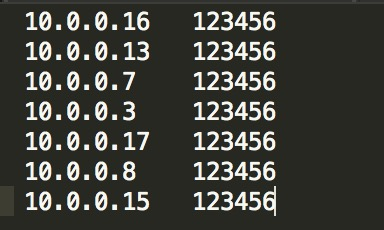
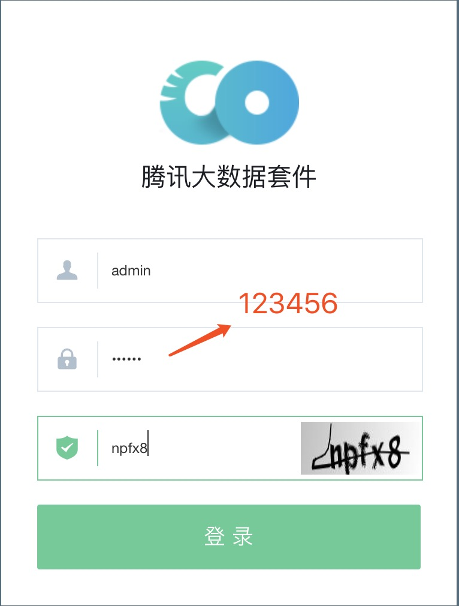
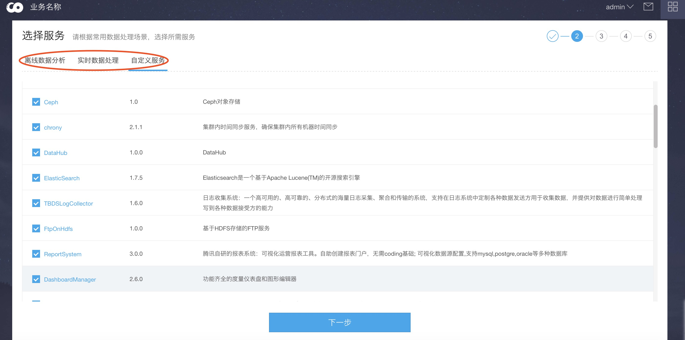
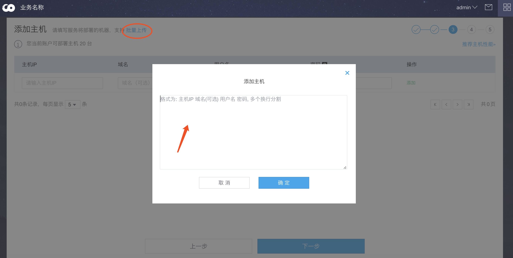
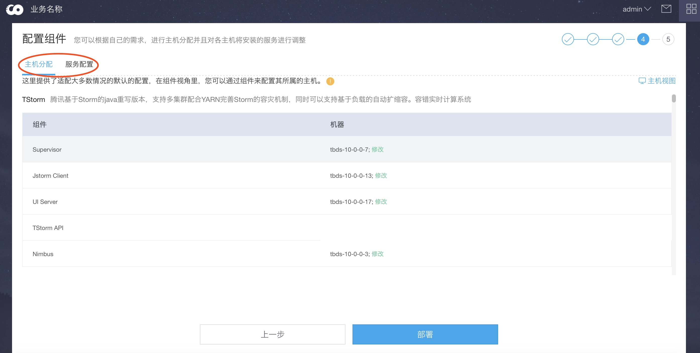

# 安装步骤

## 前置条件

软件清单

* tbds-mirror-$**version**.tar   \(其中$version为TBDS版本号\) \*
* tbds-mirror-patches-$**version**.tar.gz
* tbds-tools.tar.gz \*

License

* 请联系腾讯大数据商务或供应商

系统

* 部署TBDS需要root用户
* 请提前格式化并挂载好数据盘,多块数据盘须按照/data1, /data2 ... 顺序挂载

## 部署Portal节点

> 确保上述软件清单软件已经在 **/data** 目录

准备两个节点作为portal主备，在主portal节点上执行以下部署操作：

修改 **/data/.tbds.ini**

```text
ROOTPWD="123456"    # 主机root密码，用于portal部署和机器初始化
LOCALIP=xxx.xxx.xxx.xxx # portal用于数据传输网段内网ip，非管理网段ip
PUBLICIP=xxx.xxx.xxx.xxx   # portal提供web访问的公网ip，无公网ip则填内网ip
SLAVELOCALIP=xxx.xxx.xxx.xxx   # portal slave节点内网ip，生产环境必须填写，测试环境无slave portal节点可留空
SLAVEPUBLICIP=xxx.xxx.xxx.xxx   # portal slave节点公网ip，生产环境必须填写，测试环境无slave portal节点可留空
```

创建 **cluster.info** 集群描述文件

```text
# cd /data
# vim cluster.info
```



* 注：portal节点需要在cluster.info文件的第一行, 此处假设root用户密码为123456

初始化集群并部署portal

```text
# tar xzf tbds-mirror-$**version**.tar.gz -C /data     (解压安装包，解压后目录为/data/rpm)
...
# tar xzf tbds-mirror-patches-$**version**.tar.gz -C /data
...
# tar xzf tbds-tools.tar.gz -C /data    （解压工具包，解压后目录/data/tools）
...
# /data/tools/tbds-bootstrap.sh init
...
# /data/tools/tbds-bootstrap.sh check
...
# /data/tools/tbds-install-portal.sh
...
```

部署成功后会显示portal的访问地址，接下来通过portal进行TBDS集群部署

## 部署TBDS集群

* 登陆portal\(默认用户密码: **admin/123456**\)



* 输入License, 阅读用户协议，并开始


* 选择需部署的服务



* 输入服务器列表\(portal节点需要在第一行\)



* 服务主机分配\(根据实际情况调整\)



* 服务配置（**多磁盘**需要在此处调整各服务配置,如下示例）


* 开始部署


集群部署完成大概需要30分钟，完成后请注意修改admin用户的密码

