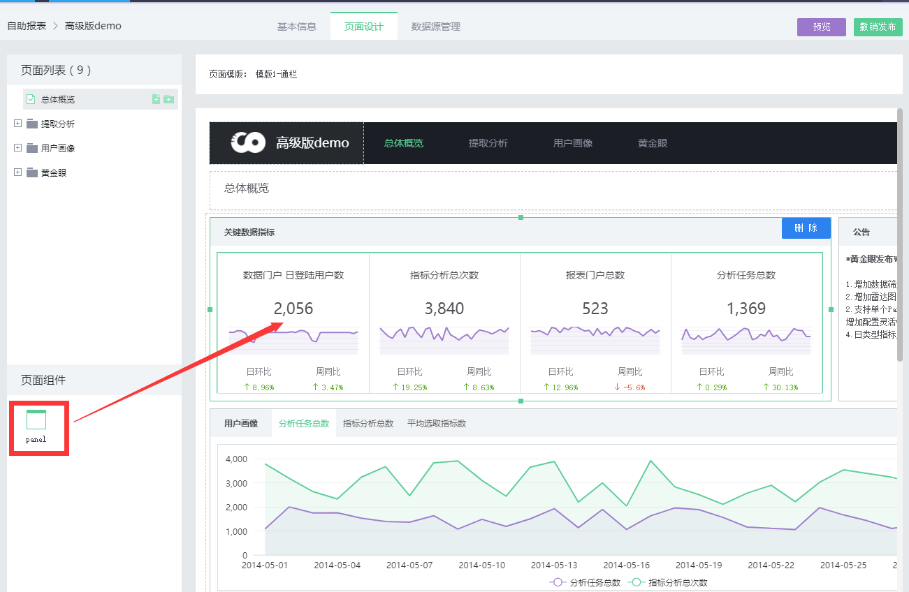
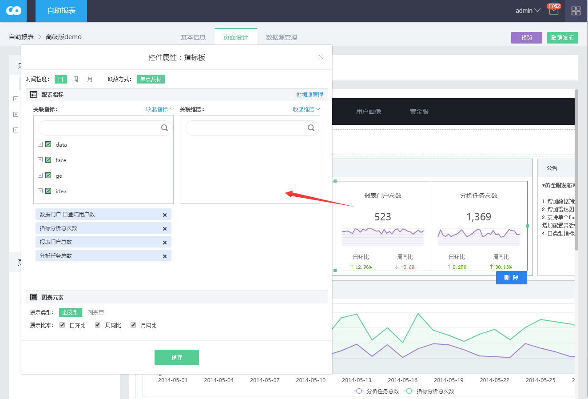

# 自助报表

自助报表是一款可视化运营报表门户制作工具，适用于运营数据分析结果的展示环节

可以输入2种报表门户，分别是基础版、高级版

| 类型 | 基础版 | 高级版 |
| :--- | :--- | :--- |
| 适用对象 | 运行开发 | 产品经理、运营开发等 |
| 定位 | 快速创建在线运营报表门户，支持多维对比筛选 | 标准数据报表门户，拥有完整网站信息导航，能自定义页面元素 |
| 适用对象 | 运营开发 | 产品经理、运营开发等 |
| 页面模板 | 标准折线图报表模板 | 通览模板、左右两栏模板、自定义页面链接模板 |

 **一、基础版** 

 **1.创建门户** 

 

> 基础版，高级版选定创建后不能更改 门户权限公开则创建后所有人可见

 **2.配置数据库** 

创建门户后，可以进入“数据源管理”模块设置数据库 

> 填写完后可点击“测试”测试配置是否正确

 **3.设计页面** 

选择上个步骤的数据库，然后选择表，字段，配置字段 

> 数据来源选择“自定义URL”可以嵌入第三方URL 选择数据表 选择“自定义SQL”可以自己写表sql

编辑字段指标信息 

> 自助报表的报表基于时间轴，必须指定表的一个字段为日期字段，时间格式配置需和数据库实际数据一致

编辑页面元素 

> 如图中每一个区域块都可以点击做相关配置设置 设置完成后，可以点击“预览”看页面效果，点“发布”后页面其他有权限的人才可见

至此一个基础门户基本过程就完成了

 **二、高级版**   **1.创建门户**  同基础版

 **2.配置数据库**  同基础版

 **3.配置指标** 

从数据源管理，切换到“指标管理” 

> 配置过程同基础版设计页面第一个步骤

 **4.纬表管理** 

如果一个指标字段需要翻译，比如“省市”，就需要配置纬表 

> 可以从库表选择已有的翻译对照表，也可以切换到“新增纬度信息”直接输入文本 配置好后在指标配置的时候，选择“纬度累i型”，然后就可以选择对应的纬表了

 **5.页面设计** 

拖拽一个页面组件到页面区域，选择组件类型 

> 页面菜单和左侧菜单是对应的，切换左侧菜单进行对应的页面设计

点击页面组件，选择指标 

> 页面组件的大小可以拖拽调整，删除 设置完成后，可以点击“预览”看页面效果，点“发布”后页面其他有权限的人才可见

至此一个高级门户基本过程就完成了

