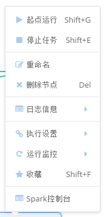
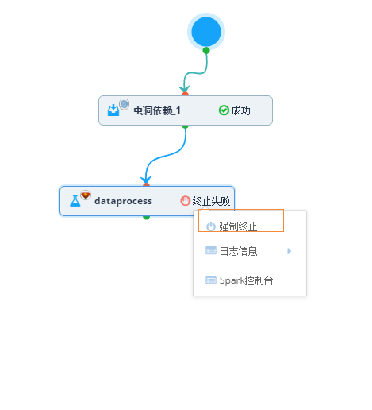

# 运行

## 1. 工作流运行

配置完所有节点，并单独调试成功后，就可以以工作流的方式运行。系统会自动根据依赖关系按次序执行各个节点任务。这是我们推荐的运行方式

工作流菜单如下：

工作流工具菜单如上图所示，从左到右分别为，

1. **运行/停止**：手动运行或停止画布上当前实例；
2. **重跑**：重跑某一个时段内的工作流；
3. **运行实例查看**：当前运行以及排队实例查看；
4. **参数设置**：设置并初始化工作流程序的参数；
5. **历史实例**：查看已经运行完的实例清单（含手工，重跑，定时，和参数驱动实例） ；
6. **定时设置**：设置工作流定时运行
7. **执行方式**：
   * 顺序执行：在多个分支的情况下，先执行完第1个分支的所有节点再执行第2个分支
   * 并行执行：多个分支下，多分支同时执行
8. **工作流设置**：设置执行使用的资源池，集群，告警策略，不同实例的并发数
9. **演示运行**：演示工作流的执行顺序，不实际执行
10. **保存**：工作流（包括节点参数）修改后会有小红点提示保存

工作流运行中，所有节点的状态都会自动准实时展示在节点上

## 2. 单个节点运行与操作

为了方便用户，我们也允许用户可以单独调试某一个节点，右键单击任一节点，都会出现右键菜单。如图所示

以下是右键菜单介绍：

1. **起点运行**：以当前节点为起始点运行工作流；
2. **停止任务**：终止任务流的执行；
3. **重命名**：更改当前节点的名称；
4. **删除节点**：删除当前节点；
5. **日志信息**：查询当前运行日志和历史日志，可以找到任务节点的执行日志和参数传递信息；
6. **执行设置**：当有节点是不想执行，但是又不想删除时，可以用该功能暂时屏蔽。是"Yes"，如果选择"No"则不执行该节点，常用于调试；
7. **运行监控**：设置时间监控和自动重试；
8. **收藏**：收藏本节点，放入画布左侧收藏夹，使用时可直接在收藏夹中拖拽出来使用；
9. **控制台**：Spark控制台/深度学习控制台（Tensorflow控制台，CAFF控制台，torch控制台等），可以通过控制台查看Spark任务的具体执行信息，具体内容见“日志查看”章节。

## 3. 强制终止

有时候任务可能会存在用户手动终止的时候出现“终止失败”的情况，通常是因为任务执行时间太长（参数配置不正确，没拿到资源等），一般情况下，之前的日志在服务器上已经被清除，获取日志失败而导致“终止”这一操作失败。 这种情况下右键菜单中会出现“强制终止”按钮， 可以通过这个按钮来强制任务失败。

**注意** 除了手工驱动的实例外， 其他的实例的强制终止都需要在实例列表中进入到这个实例页面，找到终止失败的节点，这个节点上的才会有“强制终止”的按钮哦

