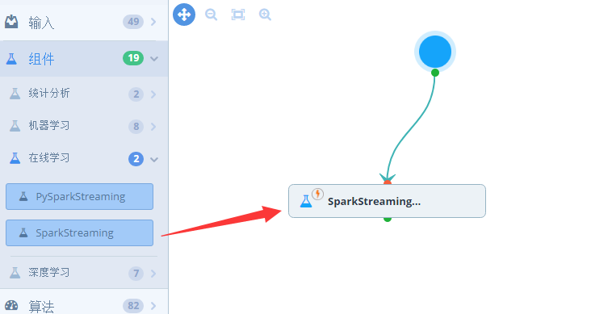
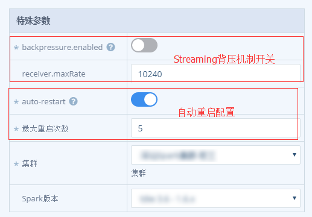

# Sparkstreaming组件

## SparkStreaming组件

> SparkStreaming组件是面向使用SparkStreaming处理实时任务的用户，用户编写SparkStreaming应用程序，通过SparkStreaming组件完成部署。和标准的Spark相比，SparkStreaming组件支持流式处理相关的特殊配置。

### 1. **从左侧组件列表里拖拽出一个SparkStreaming节点**



### 2. **单击任务节点，会从右侧弹出配置框**



> * backpressure开关：是否开启背压机制，即在计算跟不上数据的情况下，会自动降低接收数据的速率
> * receiver.maxRate：指定receiver最大接收速率，单位为每秒接收记录的条数
> * auto-restart：指定是否失败自动重启
> * 最大重启次数：指定任务的最大重启次数

其他配置操作与Spark组件类似。

## SparkStreaming使用建议

1. 增加AM & Spark Driver重试次数以及长时运行保证

   ```text
   // tdw-spark default: 1
   spark.yarn.maxAppAttempts=4
   spark.yarn.am.attemptFailuresValidityInterval=1h
   ```

2. 增加Executor失败最大容忍次数

   ```text
   // default: max(2 * num executors, 3)
   spark.yarn.max.executor.failures={8 * num_executors}
   spark.yarn.executor.failuresValidityInterval=1h
   ```

3. 开启推测执行，淘汰那些跑的慢的Task， **注意action操作是幂等的**

   ```text
   spark.speculation=true
   ```

4. 如果数据源是来自Receiver，建议num\_receiver=num\_executor，同时控制每个batch 的partition数

   ```text
   // num_partition = (batch_interval / blockInterval) * num_receiver
   spark.streaming.blockInterval=200ms
   ```

