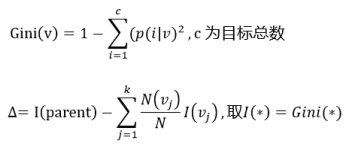
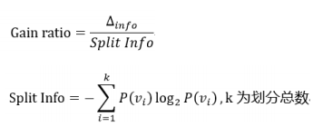

# 特征选择

* [Information Based](tdw_ml_jarvis_feature_selection.md#1-information-based)
* [ChiSqSelector](tdw_ml_jarvis_feature_selection.md#2-chisqselector)

## 1. Information Based

* **算法说明**

  基于信息的特征选择，该模块共包括4种算法：信息增益（Information Gain）、基尼系数（gini）、信息增益率（Information Gain Ratio）以及对称不确定性\(Symmetry Uncertainly\)

  * 信息增益公式：

  

  * 基尼系数公式：

  

  * 信息增益率公式：

  

  * 对称不确定性公式：

  ，其中H\(X\)与H\(Y\)为信息熵, IG\(X/Y\)为信息增益

* **输入**
  * 数据形式：[Dense](../tdw_ml_jarvis_dataformat.md#21-dense数据格式)
  * 格式：\| label \| 参与计算的features \| 不参与计算的features \| 
  * label：仅存在0或1。通过**算法参数**中的**目标标签所在列**指定。
  * 参与计算的features：可通过**算法参数**的**特征所在列**指定
  * 不参与计算的features：可包括不参与计算的特征
* **输出**：
  * 格式： \| X \| IGR \| GI \| MI \| SU \| \| Id \| IGRImp \| GIImp \| MIImp \| SUImp \|
    * X：无实际意义，用来形成有效的矩阵形式
    * IGR：标题，表示信息增益率
    * GI：标题，表示基尼系数
    * MI：标题，表示信息增益
    * SU：标题，表示对称不确定性
    * Id：被选择的特征Id
    * IGRImp：特征的信息增益率
    * GIImp：特征的基尼系数
    * MIImp：特征的信息增益
    * SUImp：特征的对称不确定性 
    * 举例：

      ```text
      # 特征重要度矩阵
       X IGR GI MI SU
      1 0.03 0.04 0.2 0.07 
      2 0.15 0.018 0.38 0.009 
      3 0.25 0.33 0.025 0.17
      ```
* **参数**：
  * 特征所在列：表示需要计算的特征所在列，例如“1-12,15”，其说明取特征在表中的1到12列，15列，从0开始计数
  * 目标标签所在列：根据目标标签在表中的位置，从0开始计数
  * 并行数：训练数据的分区数、spark的并行数
  * 抽样率：输入数据的采样率

## 2.  ChiSqSelector

* **算法说明**

  该模块基于卡方独立性检验进行特征选择。特征选择过程将根据卡方独立性检验结果，将每个特征对应的卡方统计量按照从大到小的顺序进行排序，根据这一排序用户可指定选择的特征个数，否则系统将根据默认值提取前几个特征。**需要注意的是**，该模块对连续型数据也采用离散数据的方式进行统计，并且要求目标变量和特征的数值种类个数不能超过10000。因此，对于连续型数据最好先通过离散化方式进行处理，再进行特征选择。

* **输入**
  * 数据形式：[Dense](../tdw_ml_jarvis_dataformat.md#21-dense数据格式)
  * 格式：\| label \| 参与计算的features \| 不参与计算的features \|
  * label：通过**算法参数**中的**目标标签所在列**指定。
  * 参与计算的features：可通过**算法参数**的**特征所在列**指定
  * 不参与计算的features：可包括不参与计算的特征，如果存在则保留在输出中
* **输出**
  * 格式：\|不参与计算的features \| 被选择的特征 \|
* **参数**：
  * 特征所在列：表示需要计算的特征所在列，例如“1-12,15”，其说明取特征在表中的1到12列，15列，从0开始计数
  * 目标标签列：目标标签所在列，从0开始计数
  * 选择的特征个数：选择的top特征个数
  * 并行数：训练数据的分区数、spark的并行数
  * 抽样率：输入数据的采样率 
* 
