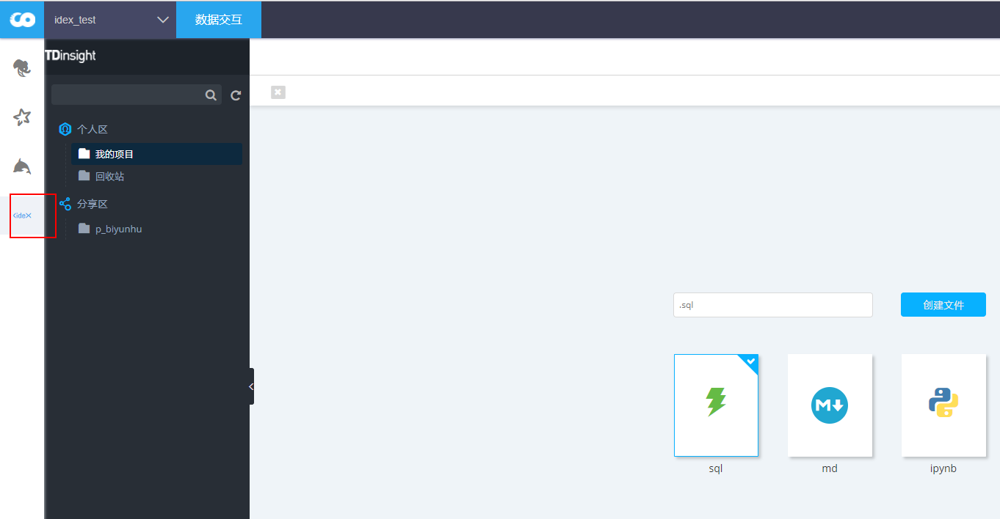
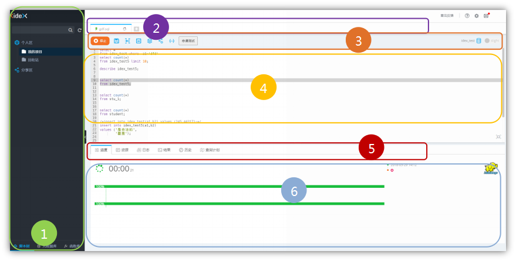
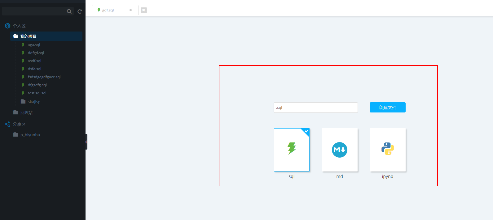
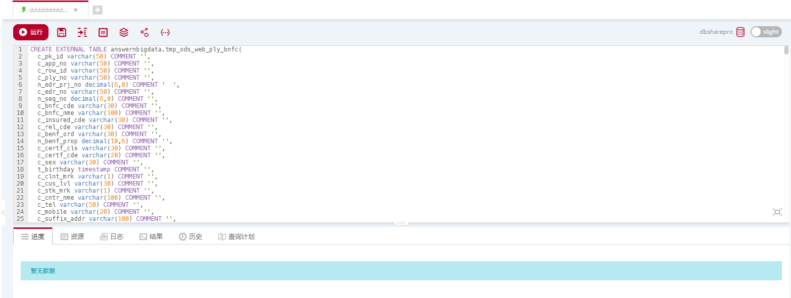
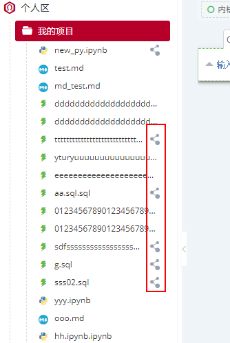
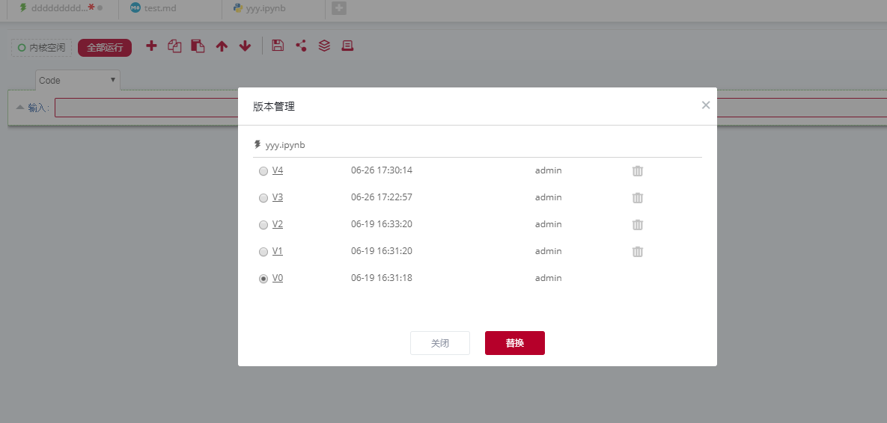

# ideX

## 1.介绍

ideX是一款集合数据挖掘、可视化、定时任务于一体的数据分析产品，其主要功能特性有：

* SQL分析执行（SQL Analyzer）
* Notebook
* 可视化（Visualization）
* 多人协作编辑（Collatorative editing）

## 2.使用

如下图所示，在数据分析页面中左侧点击_ideX_图标则进入主页。

### 2.1 UI布局

ideX UI布局如下图所示:

### 2.2 脚本树

使用ideX需要创建文件，所有的操作都是在文件里面执行的。在左侧_脚本树_页签中可以自由创建和组织文件、文件夹。如下图所示，在_我的项目_上右键弹出的菜单中选择_新增文件夹_可以创建子文件夹，在该子文件夹下右键又可以进一步进行上述操作。

当选择_新增文件_时，需要对文件取一个唯一的名称。可以创建三种类型的文件，分别为sql、markdown、notebook，如下图所示。 

在文件和空文件夹上右键可以删除，删除后的文件或者空文件夹可以在回收站中找到并右键恢复，类似于windows操作系统的回收站。_分享区_在随后讨论。

### 2.3 元数据库

在左侧_元数据库_页签中可以查看有权限的数据库和表，如下图所示。其中集群选择“_default_”即可，保留用于后面多集群的支持，在_数据库_下拉框中可以选择数据库，在数据表下拉框中可以选择和查看有权限的表名及表结构。

元数据库中的库表根据所选择项目的不同而变化。每个项目有权限的库表可以在套件首页【**数据资产**】-&gt;【**库表管理**】中进行配置（创建、修改、删除等）。

**注意**：如果没有数据库或这表的权限请在**库表管理**中查看或申请，元数据库中的库和表数据都来源于库表管理模块。

### 2.4 函数库

左侧的_函数库_页签提供了一些常用的hive函数用法的快速检索帮助文档，如下图所示，在输入框输入函数名回车后即可显示搜索到的函数，点击其中的函数名在下方会显示函数的用法信息。也可以根据函数分类展开查找相关函数。

### 2.5 sql文件

新建sql文件后，可以看到总体布局如下图所示：

#### 2.5.1 sql文件上侧菜单栏介绍

菜单栏如下图所示：

光标悬浮可以看到各个图标的功能说明。从左至右依次是运行按钮、保存按钮、sql格式化按钮、查看执行计划按钮、版本管理按钮、分享按钮、参数化运行按钮、常用数据库选择切换按钮、full/slight模式切换按钮。

#### 2.5.2 sql执行

sql文本输入区可以输入多个sql，sql与sql之间使用";"隔开，可以点击批量顺序执行，也可以选中部分运行。运行有slight模式和full模式两种，默认为slight模式，slight模式查询效率较高，但最大返回结果集为2万条；full模式查询效率较低，可以下载全量结果集。如无特殊需求建议使用默认的slight模式执行sql。

执行sql后，在下方的“进度”页签中可以看到执行进度，在“资源”页签中可以看到当前资源池的资源情况，资源池是跟随项目而变化的，切换项目则资源池也会变化。在“日志”页签中可以查看到执行的日志，当执行结束后则在“结果”页签中会显示查询结果。此外还可以在“历史”页签中查看sql的历史执行情况。当点击顶部“查询计划”按钮时会在下方的“查询计划”页签中显示查询计划。

#### 2.5.3 sql带参数运行

点击sql文件上方右侧的“运行参数”按钮，则会弹出运行参数文本框，在文本框中可以设置运行参数。参数有枚举型、范围型、固定型三种。设置运行参数时key为变量名，value为具体的参数值，当设置后，就会使用参数替换文件中形如${var}的placeholder。举例来说，如果sql中有形如${name}的placeholder，当设置key名为name的运行参数时，则会使用设置的参数替换sql中的placeholder。如不确定可以在“运行参数”对话框中点击“预览”按钮查看实际执行的sql是否符合预期。

### 2.6 markdown文件

新建.md文件后即可输入编辑markdown文本，markdown文件的写法是通用的，如不熟悉可以搜索相关写法，这里不再赘述。

### 2.7 notebook文件

notebook文件后缀名为.ipynb，用来执行python以及pyspark代码。启动notebook需要消耗一定的集群资源，一般需要30秒左右启动，如果集群负载较高则启动时间会更长。当左侧状态栏显示为“内核空闲”时则可输入python代码并执行。

### 2.8 文件分享

三种类型的文件均可以进行分享，分享的对象是同一项目内的其他用户。分享的时候可以指定读、写、和执行的权限，类似于linux文件系统的权限管理。点击确定后，则被分享者登录后可以在分享区看到其他用户分享过来的文件。被分享的文件在左侧会显示分享标志。分享后的文件也可以取消分享，在分享设置中把相应用户删除即可。

### 2.8 版本管理

三种类型的文件均可以进行版本管理。当文件内容发生变动且点击保存按钮时则会生成新的版本，页面只显示最近的5个版本。另外如sql文件等也有自动保存功能，当文件发生改动后大概一分钟左右会自动保存从而生成新的版本。

### 2.9 FAQ

Q:执行的sql语法标准是什么？ A:SQL是标准的HIVE2 SQL。

Q:notebook执行的pyspark是定制过的吗，版本是多少？ A:pyspark是标准的spark2.1版本。

Q:notebook可以自动补全吗？ A:可以按tab键进行补全。

