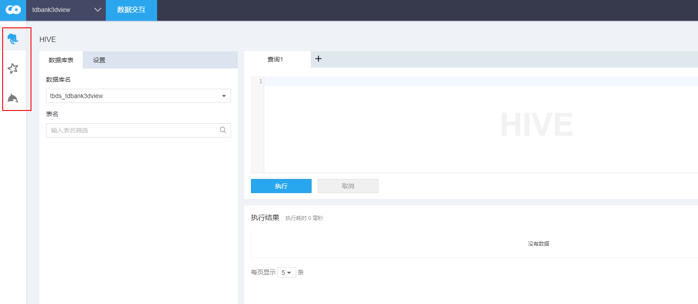
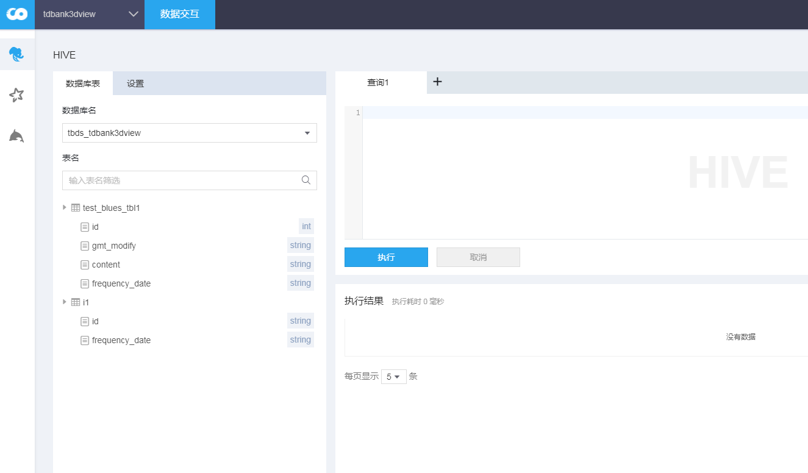
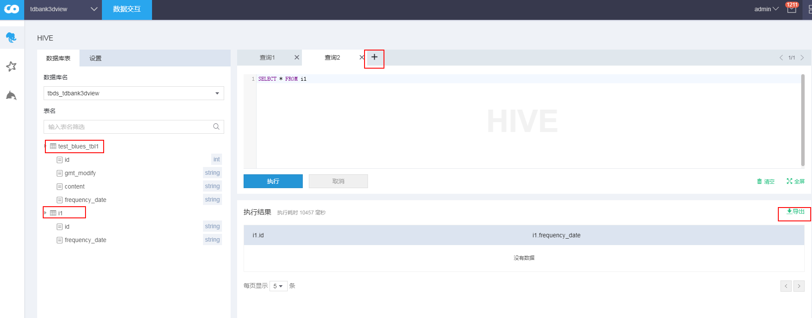
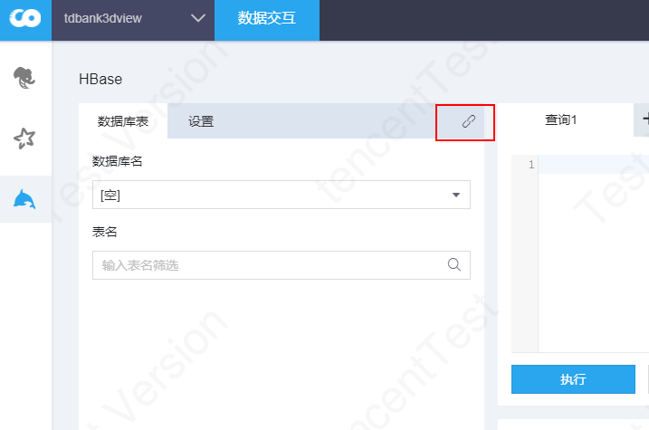
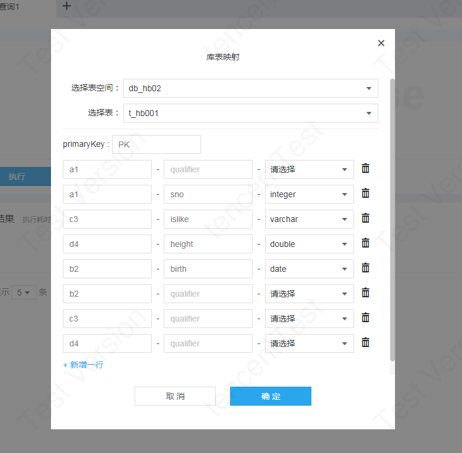
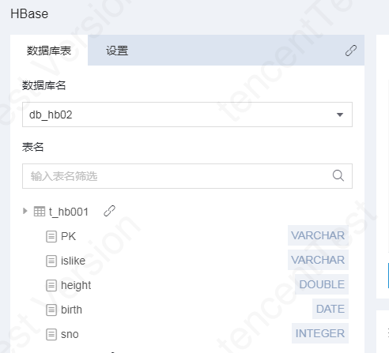

# 数据交互

## 1.介绍

数据分析（supersql）提供了访问sparksql、hive、phoenix的简洁易用的界面，能够：

* 查看有权限的数据库、表和各字段类型等元数据信息
* 使用sql语句进行数据的分页查询
* 查询结果以csv、excel格式导出
* 添加、修改UDF\(User-Defined-Function\)
* hbase表映射为phoenix表并进而使用sql进行查询

## 2.使用

如下图所示，在数据交互页面中左侧点击依次是hive、sparksql、phoenix交互页面。

### 2.1查看库表元数据信息

以hive页面为例（sparksql和phoenix页面类似），页面左侧区域【**数据库表**】页签中会列出当前有权限的数据库名、表名以及表拥有的字段及其类型。

**注意**：如果没有显示库表则是因为没有权限，请在库表管理页面中对数据库和表赋予权限。phoenix更特殊一些，除了要赋予权限外，还需要进行映射才可以执行sql，详见`2.4添加phoenix库表映射`。

### 2.2执行sql查询&导出结果

以hive页面为例（sparksql和phoenix页面类似），点击左侧表名会在中间sql输入框中生成对应表的查询sql，点击`执行`按钮即可执行sql查询，sql可使用导出按钮进行导出。导出是异步的，也就是说在导出的过程中你可以执行其他操作，只要不关闭portal页面导出就不会中断。导出完成后会存储csv格式文件到本地。同时也可以打开多个sql输入框进行操作。

**注意1**：数据分析只作查询相关的操作，元数据的管理请使用**库表管理**。 **注意2**：phoenix的语法要求表名、字段名要使用双引号，常量要使用单引号，例如`SELECT * FROM "t_hb001" where "islike"='ds'`，更多信息请参考[phoenix语法](https://phoenix.apache.org/language/index.html)。

### 2.3添加&修改UDF

#### 2.3.1添加&修改hive UDF

hive页面左侧区域点击切换到【**设置**】页签，在**数据库**下拉列表中选择目标数据库，并依次输入**函数名称**、**类名称**（点击**新增一行**可同时添加多个UDF），最后上传jar文件，创建成功后即可在sql中使用。如果需要修改则重新创建即可。

**注意1**：如果没有数据库权限请在**库表管理**中申请。 **注意2**：编写hive UDF请参考[这里](https://cwiki.apache.org/confluence/display/Hive/HivePlugins)。

#### 2.3.2添加&修改phoenix UDF

phoenix页面左侧区域点击切换到【**设置**】页签，输入**函数名称**（点击**新增一行**可同时添加多个UDF），最后上传jar文件，创建成功后即可在sql中使用。如果需要修改则重新创建即可。

**注意1**：如果没有数据库权限请在**库表管理**中申请。 **注意2**：编写phoenix UDF需要实现_org.apache.phoenix.expression.function.ScalarFunction_类，建议使用支持hbase1.2+，phoenix 4.8.1+以上的版本作为依赖进行开发，具体请参考[这里](https://phoenix.apache.org/udf.html)。

### 2.4添加phoenix库表映射

hbase属于nosql数据库，要使用sql操作hbase首先需要将qualifier映射为phoenix的column。数据分析中进行映射非常方便，在phoenix页面中点击左上区域如下图所示的图标：

在弹出的对话框中选择hbase的表空间和表，并在下方每行中依次输入columnFamily、qualifier、数据类型（不需要的可以不进行映射，也可以自行任意添加）。

点击确定，则会创建同名的phoenix表，字段名则与qualifier相同，如下图所示。

接下来就可以使用phoenix sql进行查询了。

**注意**：**TBDS4.0.4.1**之前的版本一旦映射成功是无法修改列的数据类型的，也无法将该列删除，因此使用的时候需特别注意。**TBDS4.0.4.1**及之后的版本则无此限制。

