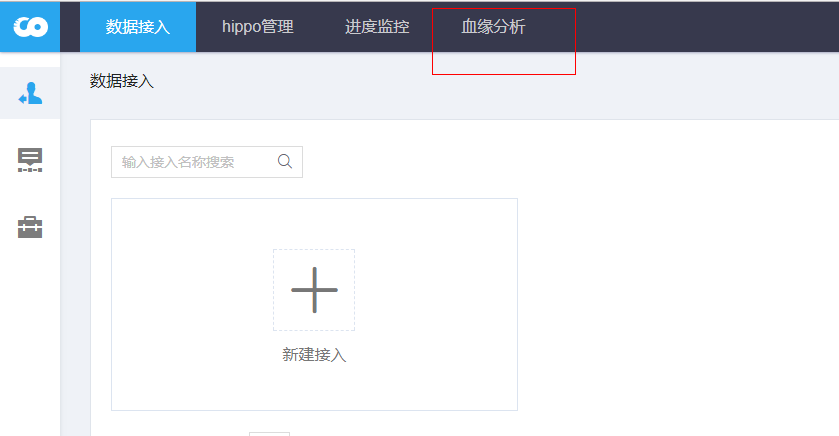
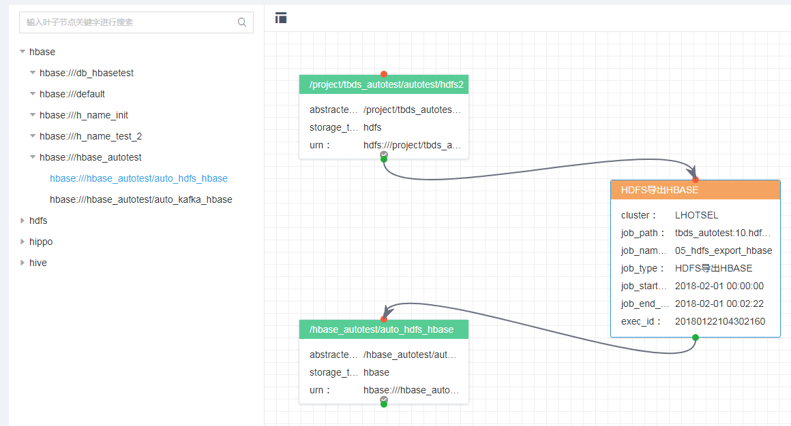
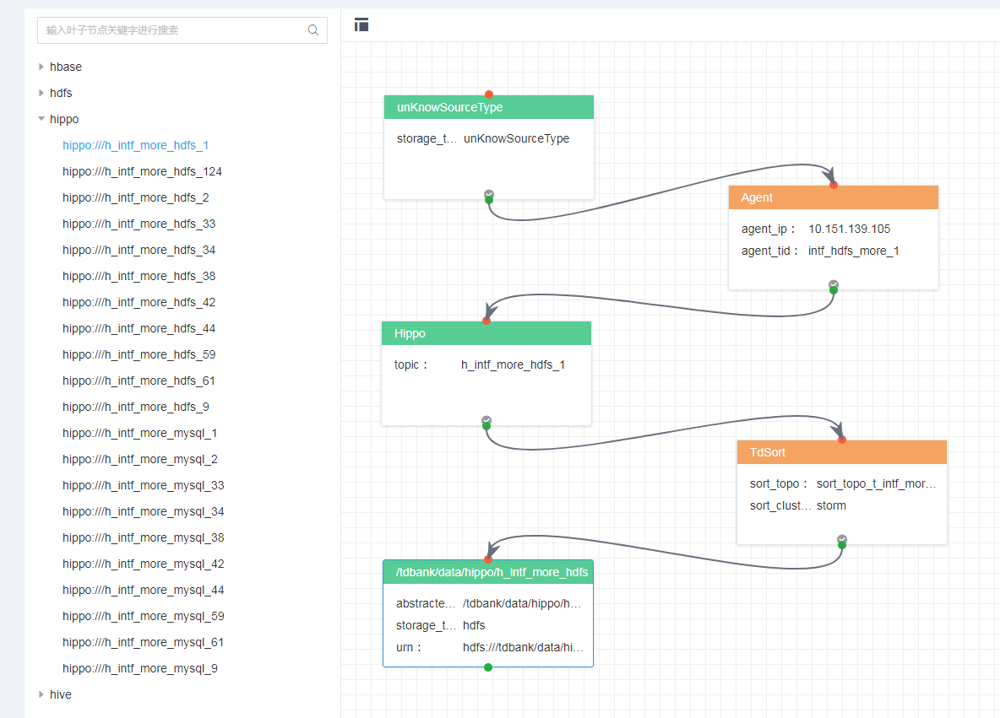

# 血缘分析

## 1.介绍

血缘分析\(wherehows服务\)在数据接入模块提供了两种数据任务的血缘展示：

### 工作流（lhotse）血缘

* hdfs文件
* hbase库表
* hive库表

### 数据接入\(hippo\)血缘

* hippo任务\(topic\)

**注意**：如果在数据接入界面没有显示血缘分析的入口则说明没有选装wherehows服务。 

## 2.用户资源隔离\(只读\)

目录树默认显示当前portal登录用户的资源文件库表名，也包括后台系统用户创建的无归属资源文件库表名。

**注意**：如果没有显示库表则是因为当前登录用户没有权限，请在库表管理页面中对数据库和表赋予权限。

## 3-1.工作流血缘分析

右侧画布里显示的是左侧目录树当前选择节点的所有血缘关系。以hive表为例，显示的是这个表参与工作流任务的任务链关系，从哪个hdfs目录导入数据之后又导出到哪里，如以下效果图：

**注意**：如果右边画布只显示单个当前节点的信息，说明该节点没有参与工作任务，所以也没有上下可追溯的血缘关系。

hbase表血缘  hive表血缘  
 hdfs血缘  

## 3-2.数据接入血缘分析

当前只包括了两种接入类型：外部数据库到hdfs或者是hive表，右侧画布显示的是左侧目录树当前选择的topic相关的所有agent信息和sort信息。以单个topic名字为例如图：

**注意**：如果右侧画布source节点显示unKnowType表示暂时不支持该类型source节点信息的显示（目前支持的只有从库表采集） 

