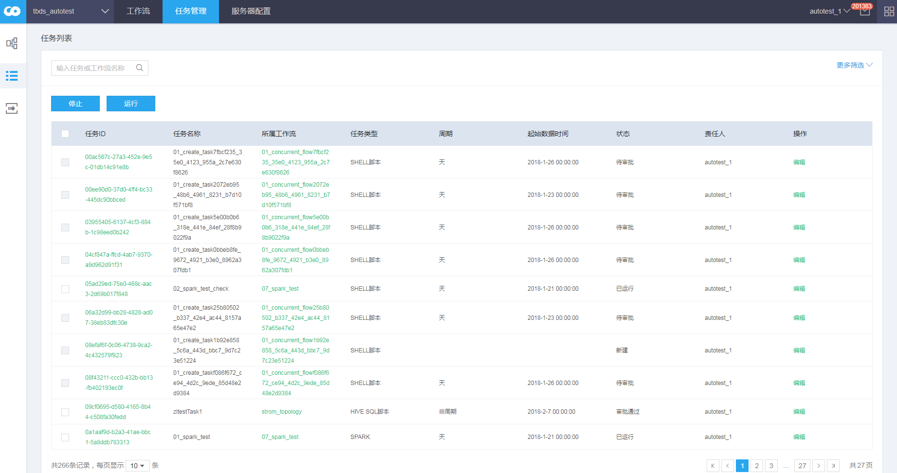
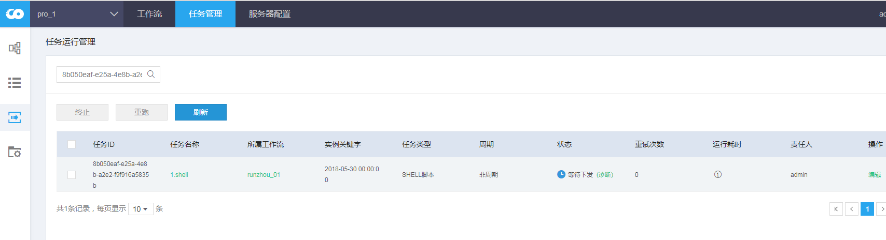
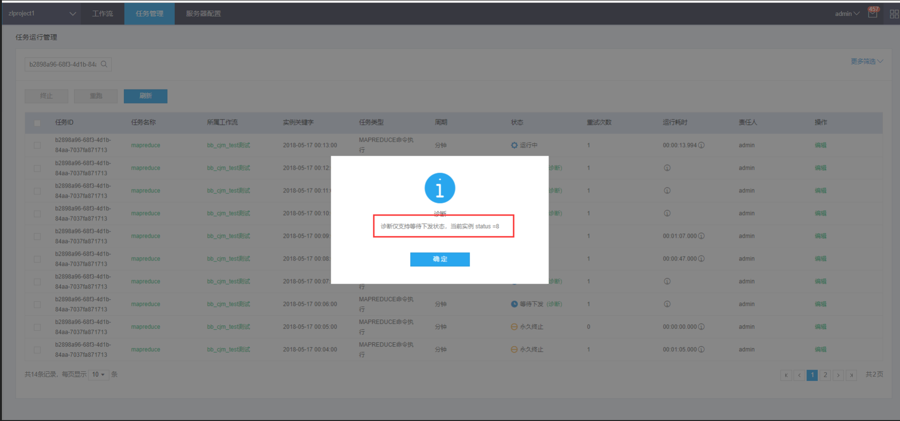

# 任务管理

### 任务管理

点击任务管理，选择左侧第二个功能项

## 页面布局

### 概要说明

可以根据任务名称，任务ID,工作流名称查询对应的任务（支持模糊查询）。

### 显示说明

参考 [说明](property.md)

#### 在返回的记录中可以做如下操作：

1. 任务id 点击任务对应的任务id，将会跳转到任务实例管理页面    跳转到   
2. 所属工作流 点击所属工作流名称，将会跳转到工作流查看页面  将会跳转到工作流查看页面 
3. 操作 编辑操作是修改任务的快捷链接  将会跳转到任务编辑页面 
4. 诊断 等待下发的实例可以通过诊断判断实例下发的进度  因为页面刷新延时的问题，可能出现如下提醒 

### 操作说明

1. 停止 选中对应任务，点击停止，可以停止对应任务。（只有任务对应的所有实例都是终止或成功状态，才能操作成功。）
2. 运行 选中停止（审批通过）任务，点击运行，将停止的任务运行起来。

