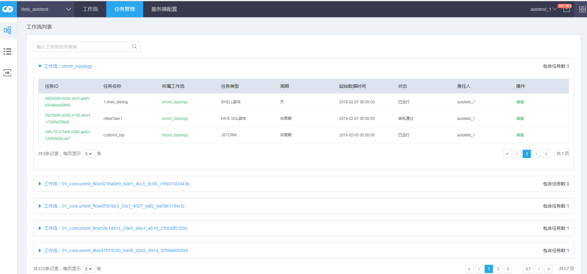
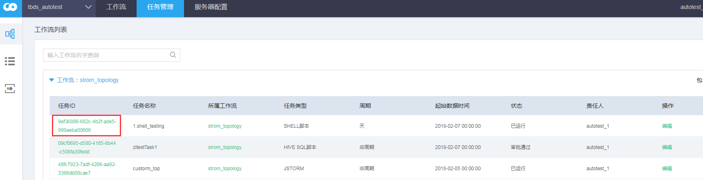
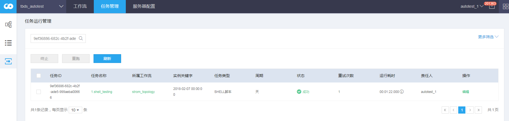
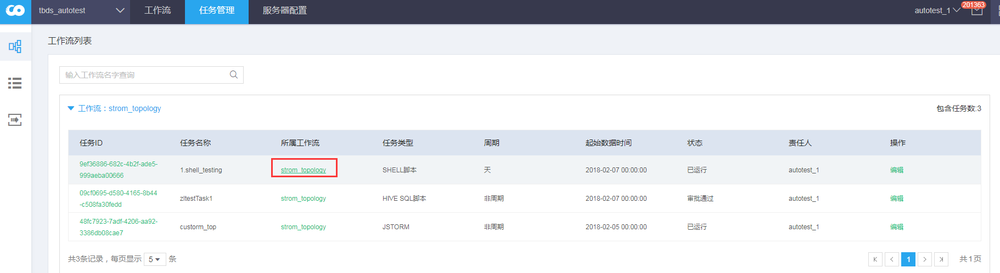
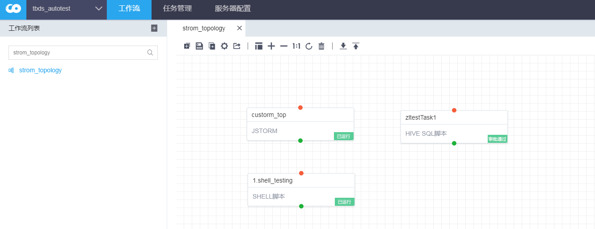
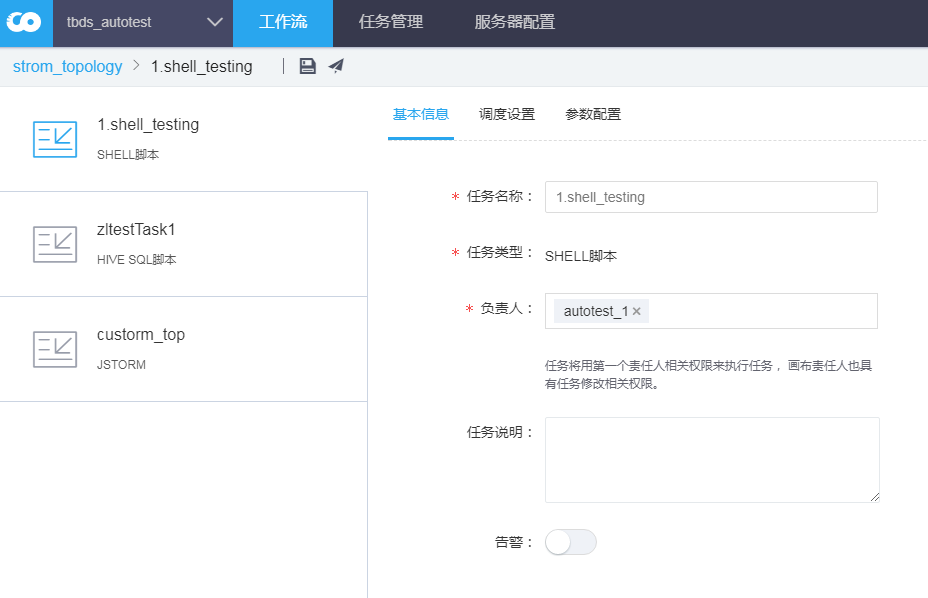

# 工作流列表

### 工作流列表

点击任务管理，选择左侧第一个功能项

## 页面布局

### 概要说明

任务按照工作流分类

### 显示说明

参考 [说明](property.md)

### 操作说明

1. 任务id 点击任务对应的任务id，将会跳转到任务实例管理页面    跳转到   
2. 所属工作流 点击所属工作流名称，将会跳转到工作流查看页面  将会跳转到工作流查看页面 
3. 操作 编辑操作是修改任务的快捷链接  将会跳转到任务编辑页面 

