# MySQL导入Hive

## 步骤（1）新建工作流

点击工作流列表右上角的“+”，在弹出的窗口中输入工作流名称“mysql\_to\_hive\_demo”，点击“确定”完成工作流的创建。

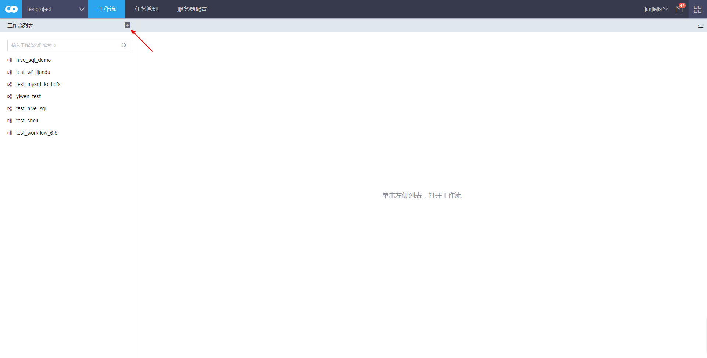

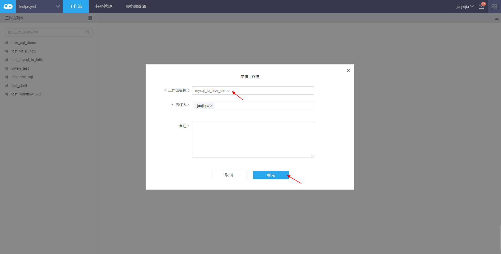

## 步骤（2）新建任务

拖拽画布左上角“+”，在弹出的窗口中选中“MYSQL导入HIVE”，点击“确定”完成任务的创建。

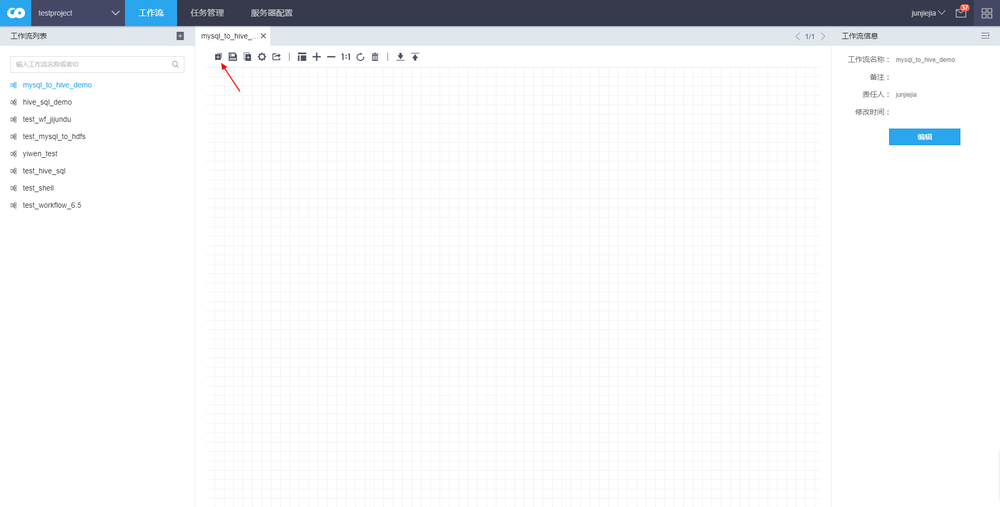

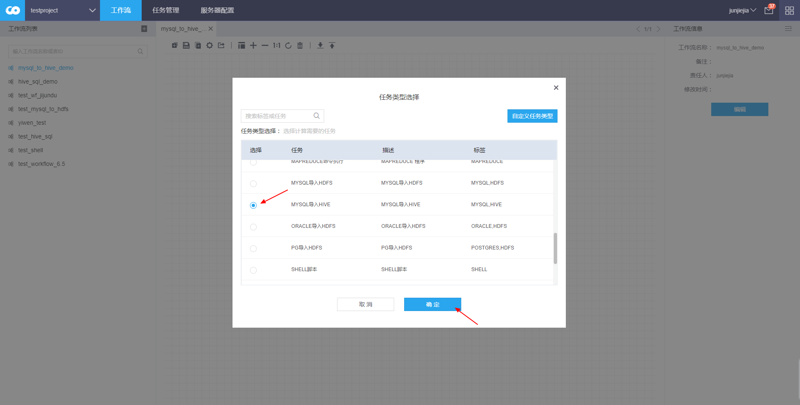

## 步骤（3）填写任务基本信息

右键点击任务框，点击“编辑”进入任务的编辑界面。

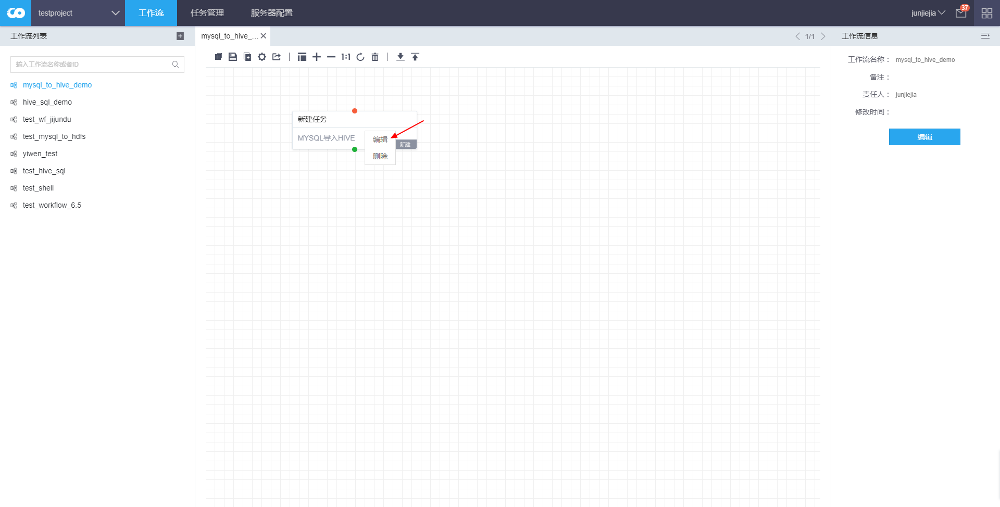

在“基本信息”中填写任务名称“mysql\_to\_hive\_demo”。

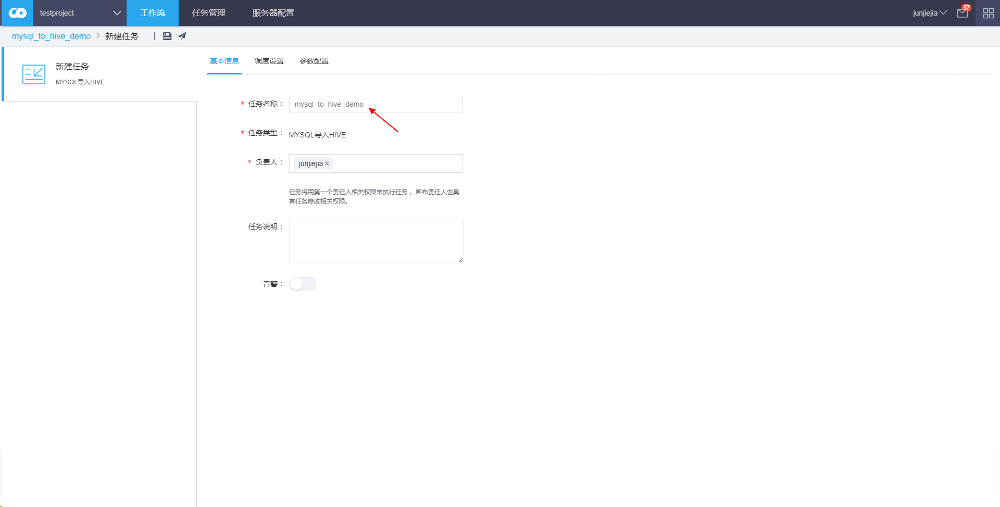

## 步骤（4）填写任务调度设置

在“调度设置”中选择周期类型“一次性非周期”。

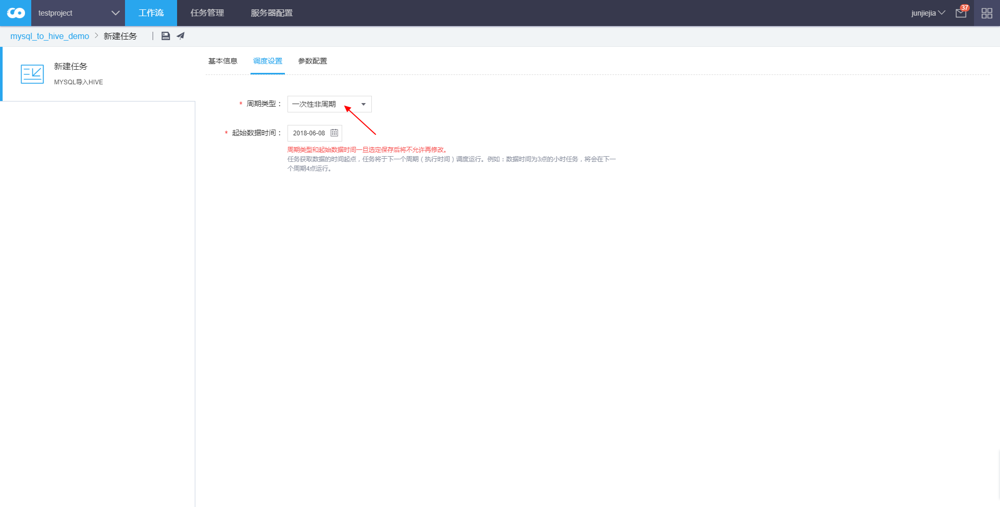

## 步骤（5）填写任务参数设置

### 配置源服务器

点击“服务器配置”页面的“新建配置”图标，在弹出窗口中，选择服务器类型“mysql”，输入服务器标识“mysql\_server”，填写MySQL服务器配置，包括主机地址、端口、database名称、数据库用户名和数据库密码。点击“连接测试”图标显示成功即可。

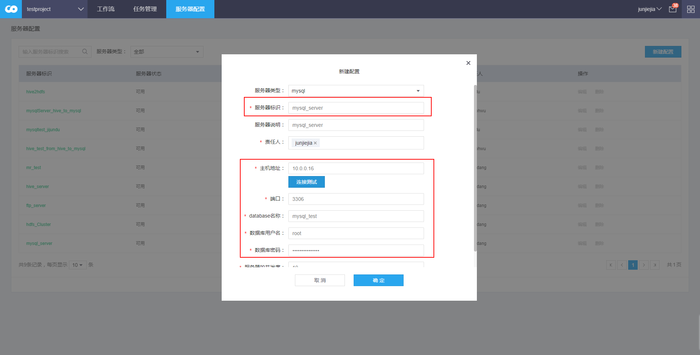

### 配置目标服务器

点击“服务器配置”页面的“新建配置”图标，在弹出窗口中，选择服务器类型“hive”，输入服务器标识“hive\_server”，填写Hive服务器配置，包括连接地址和端口。点击“连接测试”图标显示成功即可。

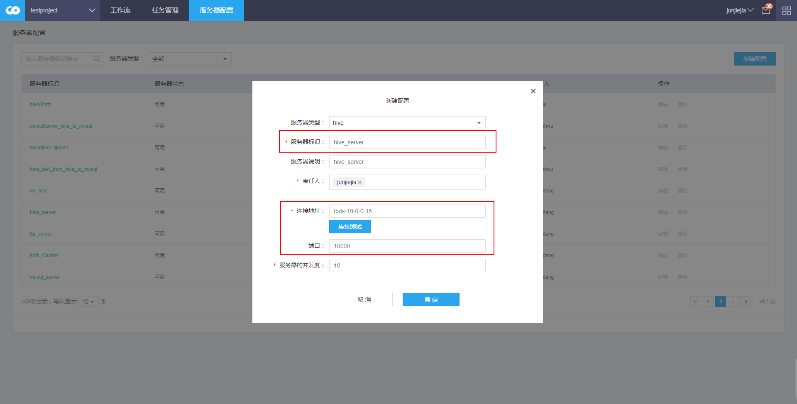

在“参数配置”中选择源服务器“mysql\_server”，目标服务器“hive\_server”；输入Select SQL“select user as mysql\_user from mysql.user”，目标DB名“hive\_test”，目标表名“mysql\_user”，源文件列名“mysql\_user”，字段映射关系“mysql\_user”。注意：应确保存在上述服务器、DB、表和字段。

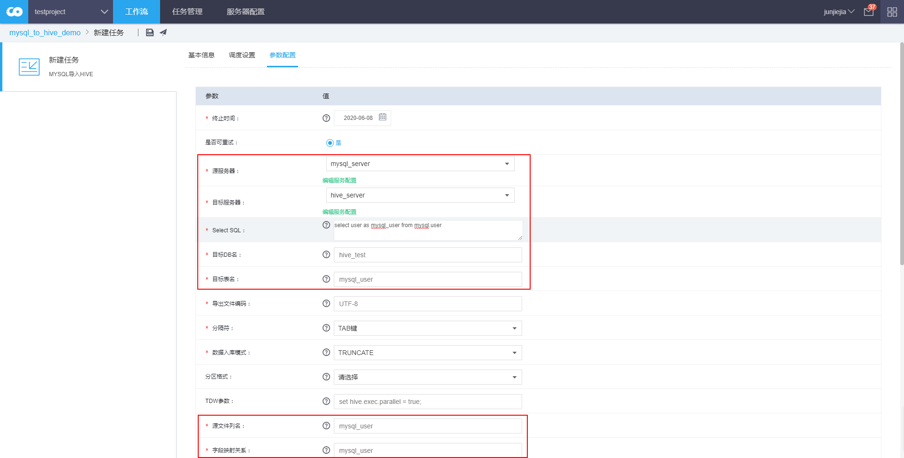

参数说明

源服务器：待导入数据所在的MySQL Server。

目标服务器：存储最终结果的Hive Server。

Select SQL：SQL查询语句。

目标DB名：MySQL DB名称。

目标表名：待写入数据的MySQL表名。

源文件列名：源文件的栏位名称，以英文逗号分割（结尾不能是逗号）,必须保证列数和文件内容一致. 创建Hive外表（临时表）所用表列名。

字段映射关系：Hive表列名,以英文逗号分隔,表示的列的内容顺序,需和DB列字段保持一致。决定从临时表往目的表里写的字段顺序。日期和常量需要用中括号包起来，例如：\[${YYYYMMDD}\], \[\'test\'\] 。

点击保存图标保存任务配置。

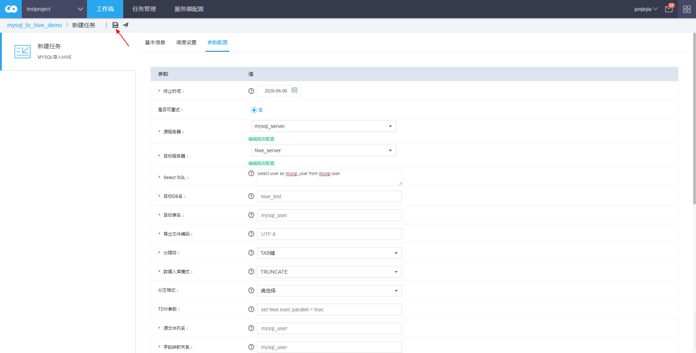

## 步骤（6）任务审批

返回工作流画布。右键点击任务框，点击“运行”，在弹出的窗口中勾选“审批通过后自动运行”，点击“确定”。

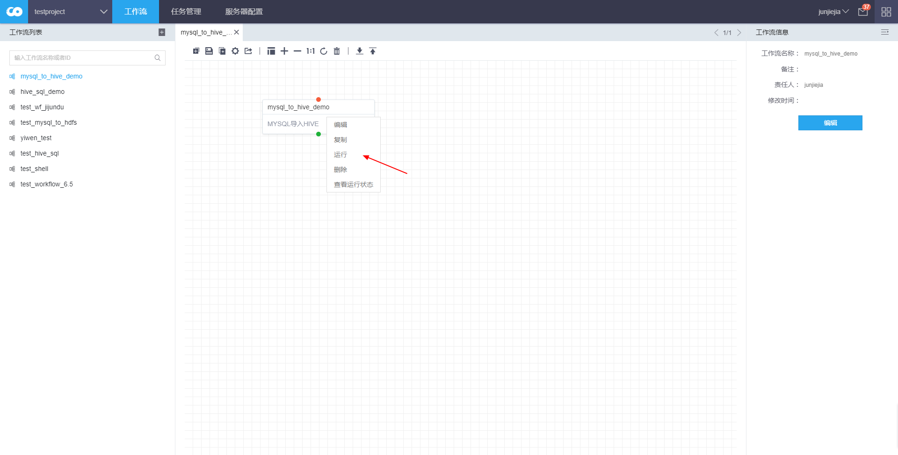

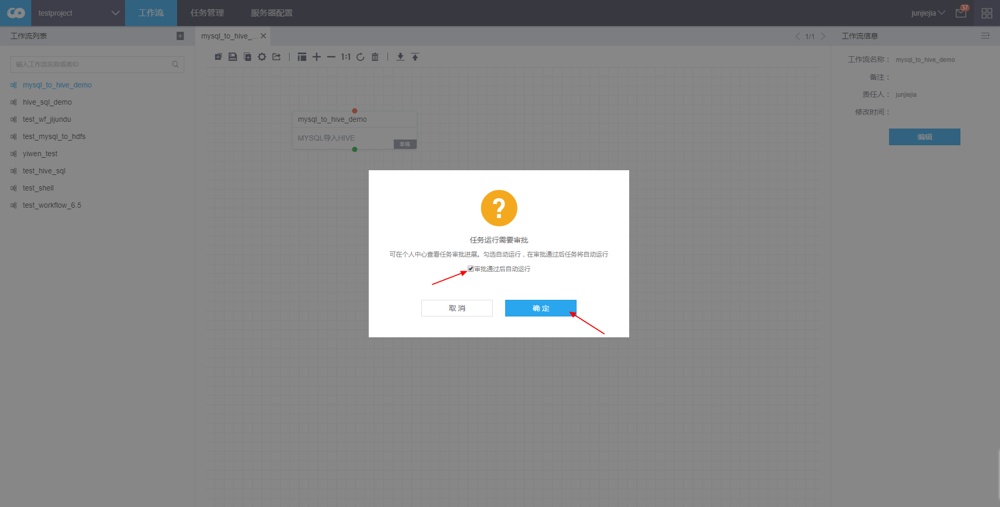

任务进入“审批中”状态，等待审批结果。

## 步骤（7）查看任务状态

审批通过后，任务进入“运行”状态，右键任务框，点击“查看运行状态”，依次为显示“等待调度”和“运行中”。

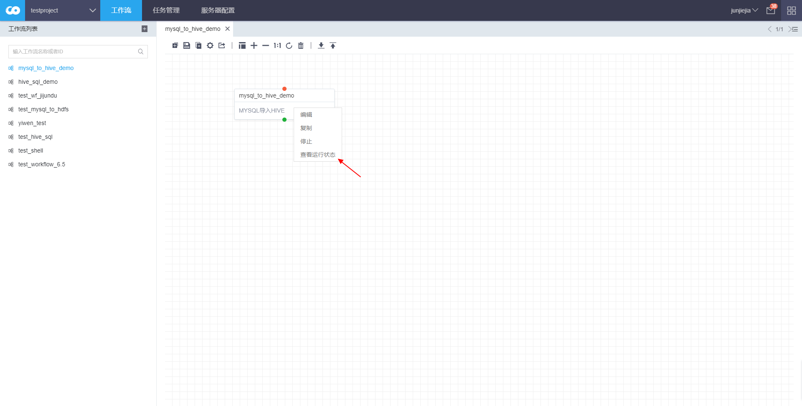

## 步骤（8）验证任务是否成功

状态变为“成功”后，点击“查看”，可以看到执行过程和运行结果。

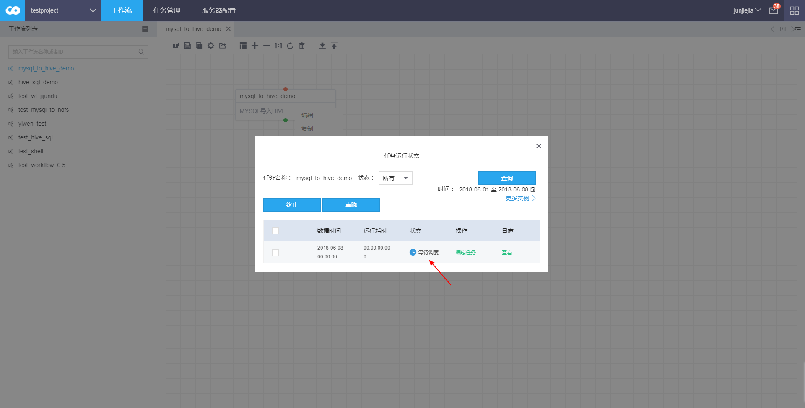

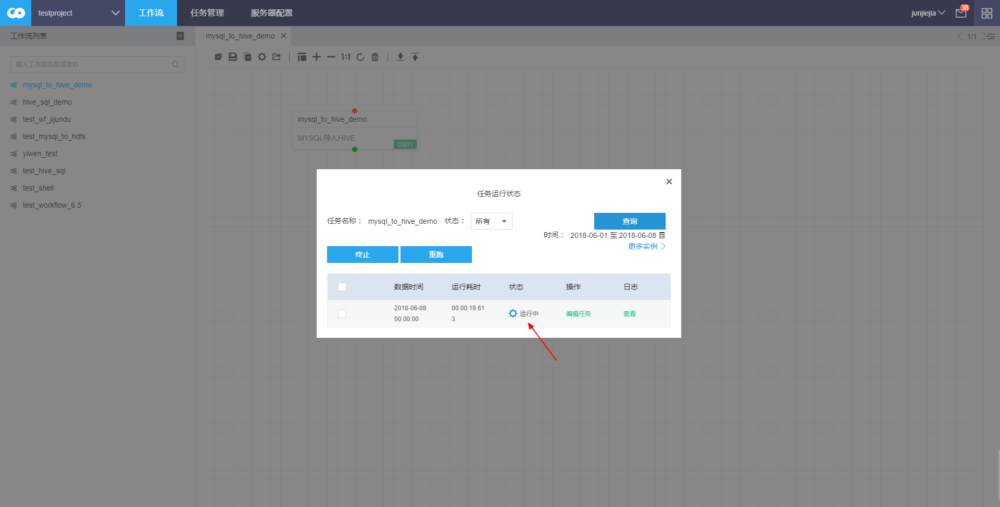

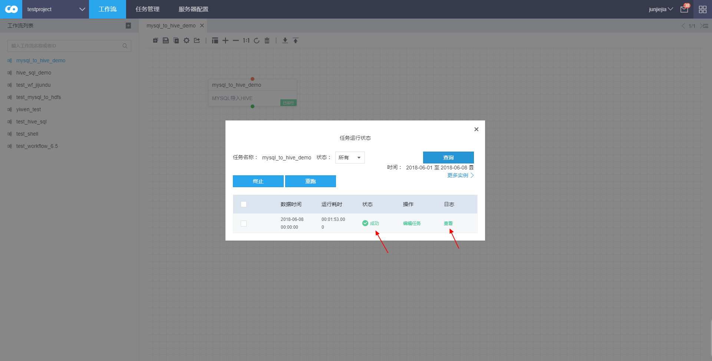

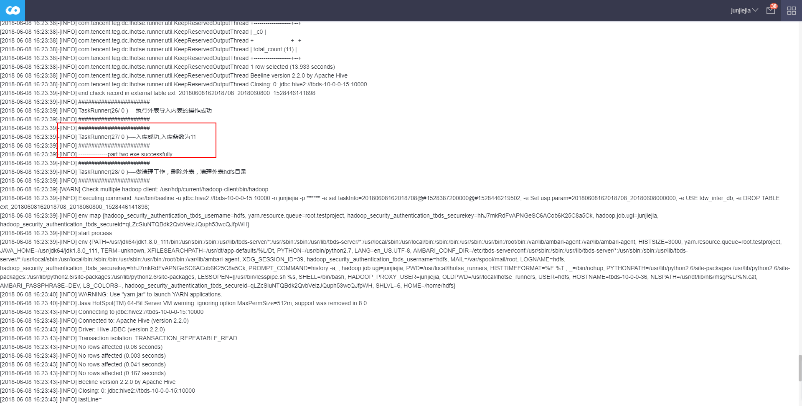

导入前后对比：

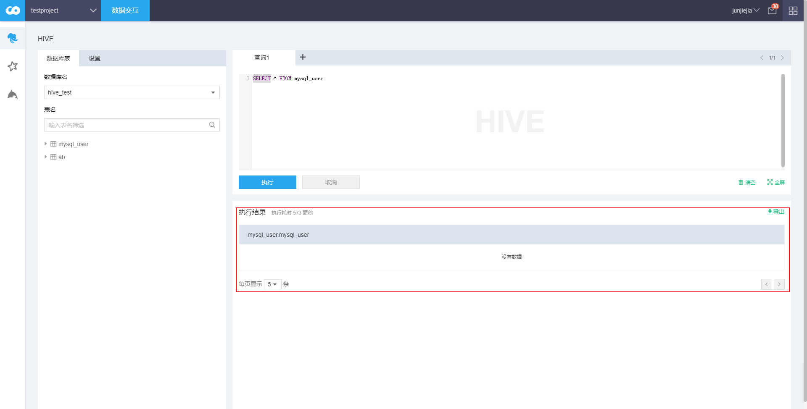

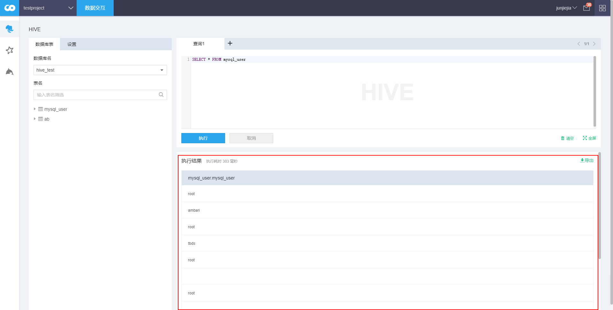

