# Shell脚本

## 步骤（1）新建任务

拖拽画布左上角“+”，在弹出的窗口搜索框中输入shell，选中“SHELL脚本”，点击“确定”完成任务的创建。

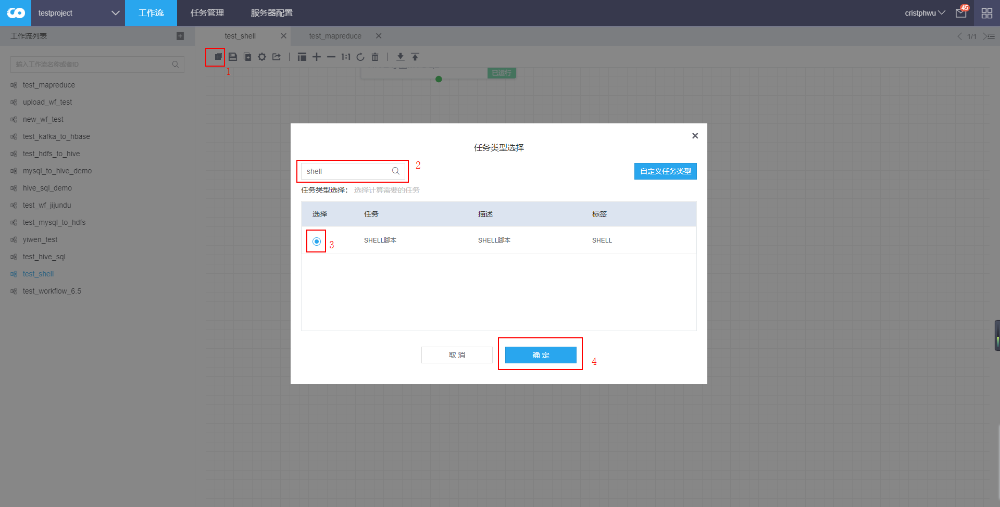

## 步骤（2）填写任务基本信息

鼠标双击任务框，进入任务的编辑界面。

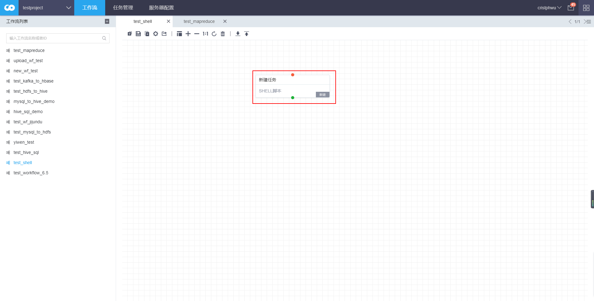

在“基本信息”中填写任务名称。

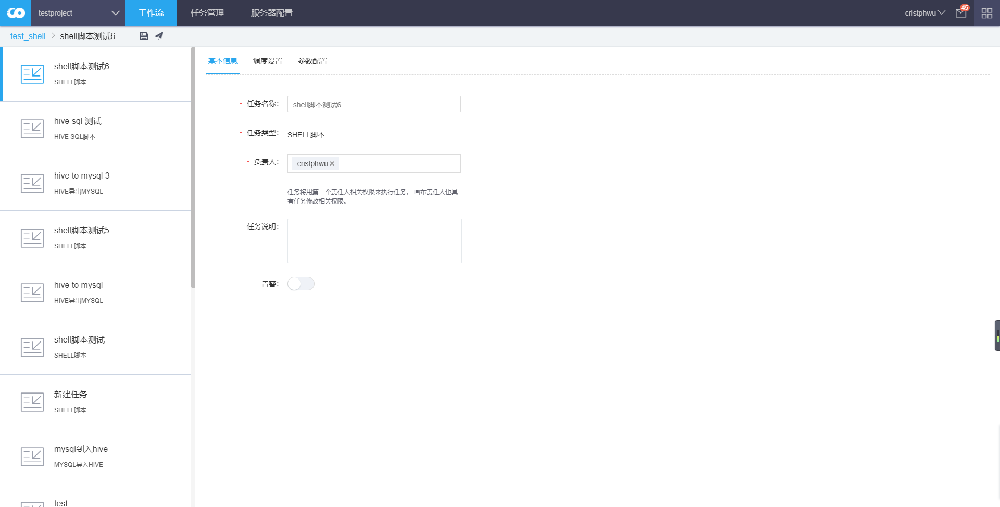

## 步骤（3）填写任务调度设置

在“调度设置”中选择周期类型“一次性非周期”。

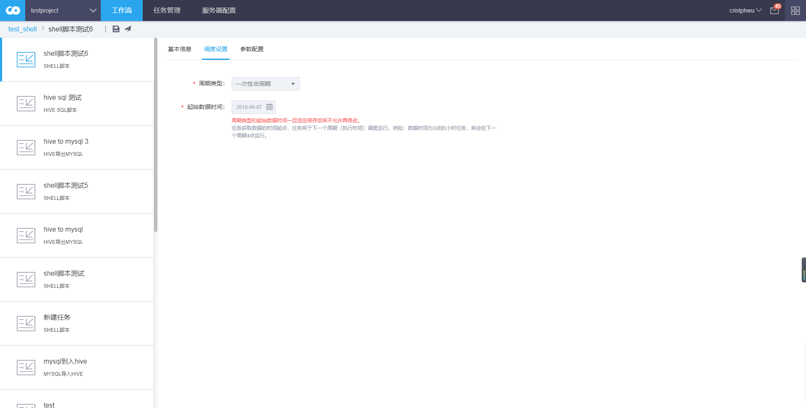

## 步骤（4）填写任务参数设置

点击“上传脚本”，在弹出的窗口中上传shell脚本文件log.sh对应的压缩包“log.zip”。脚本log.sh文件内容：

注意：脚本文件必须打包成.zip文件上传，否则将运行出错

然后在“shell命令”一栏中输入shell执行命令：./log.sh

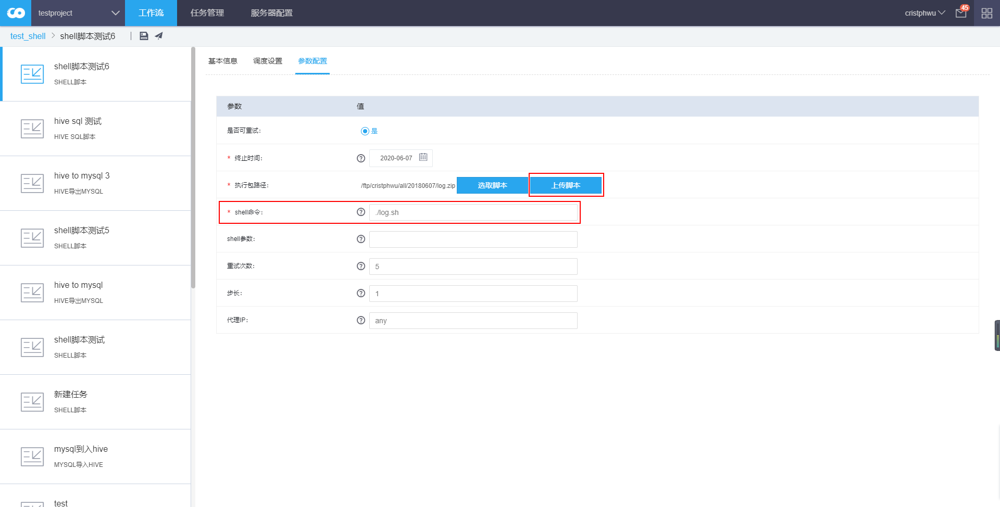

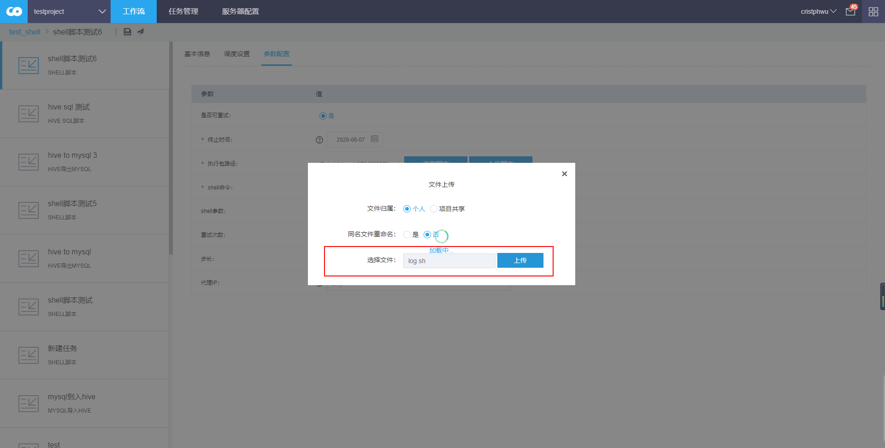

依次点击左上方保存按钮 和 运行按钮。

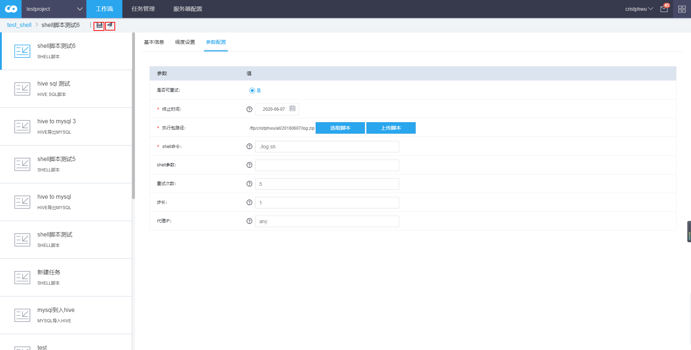

弹出框提示任务运行需要审批，选中“审批通过后自动运行”，点击确定，返回主界面。

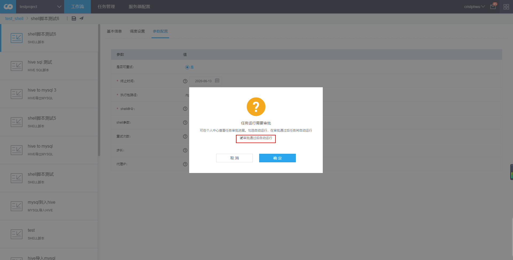

返回主界面，发现任务处于审批中。

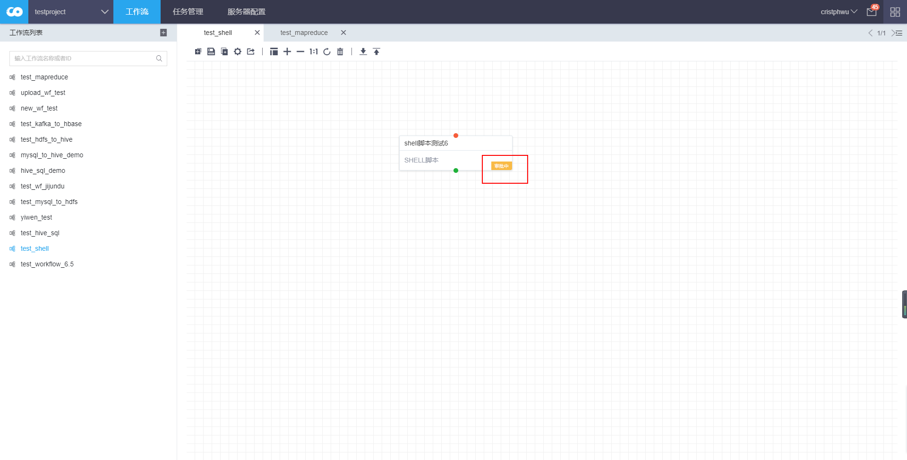

## 步骤（5）查看任务状态

审批通过后，任务进入“运行”状态，右键任务框，点击“查看运行状态”，依次为显示“等待调度”和“运行中”。

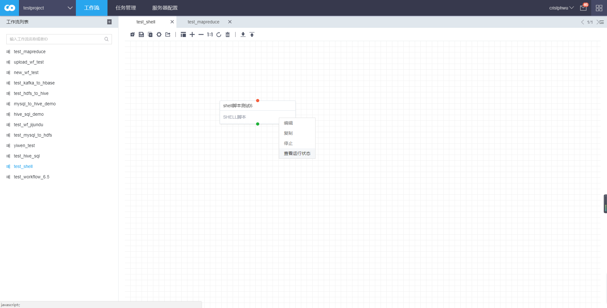

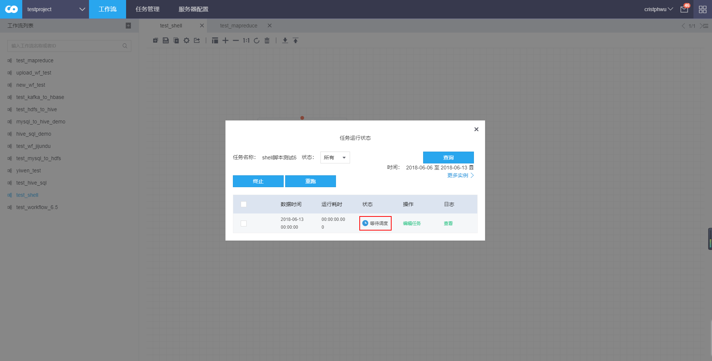

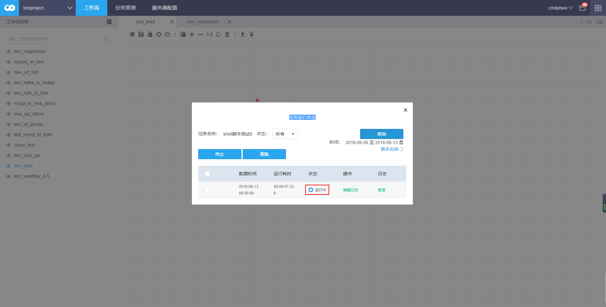

## 步骤（6）验证任务是否成功

状态变为“成功”后，点击“查看”，可以看到执行的SHELL脚本和运行结果。

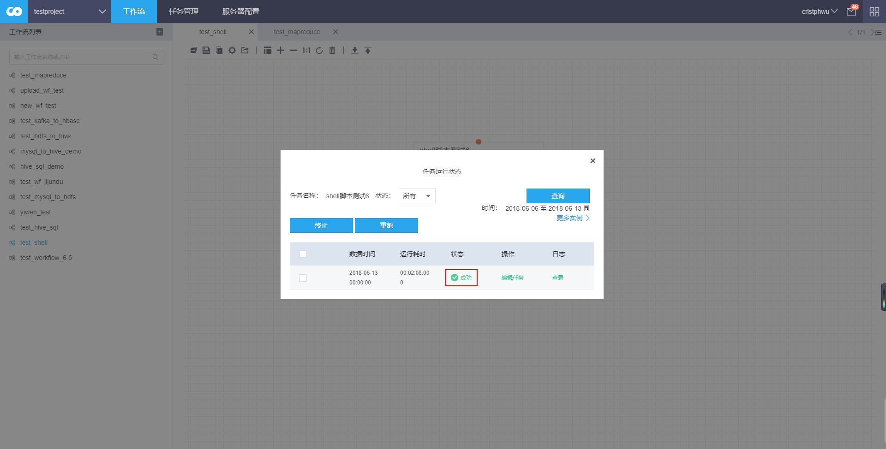

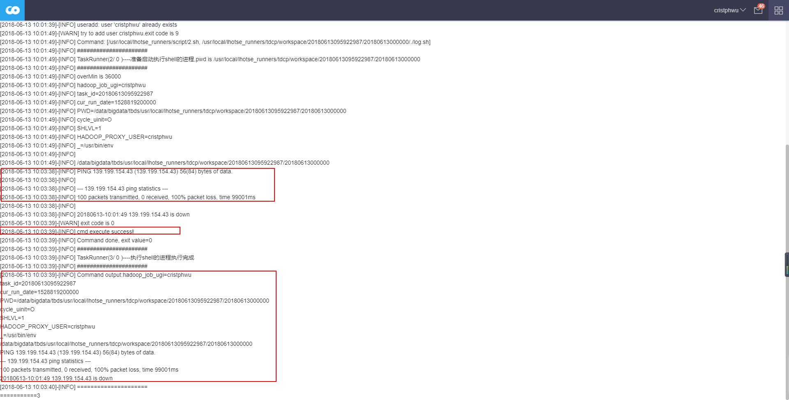

