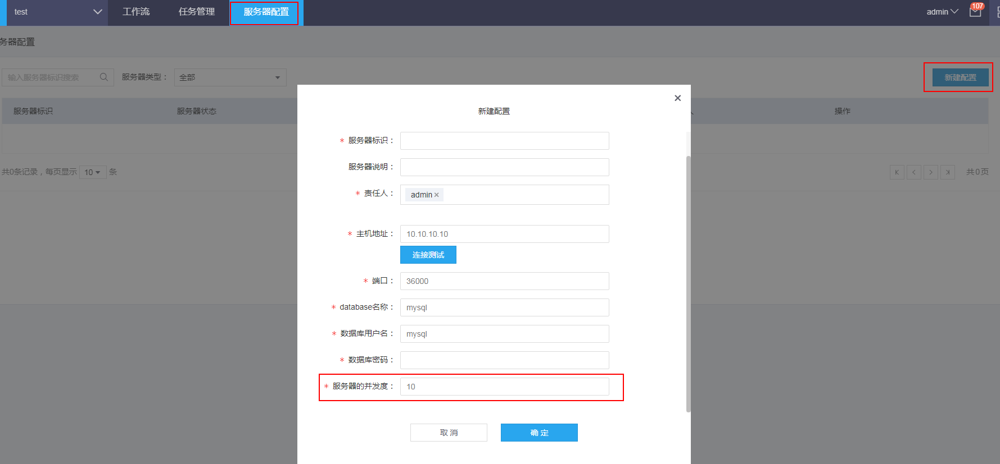

# 下发并发数说明和调整操作

taskSchdule有多种粒度的并发控制： 可以从下面几个方便来说明: 1. 服务器配置的并发数控制 2. 某任务类型对应实例在某节点上并发数控制 3. 实例在集群上并发数控制

## 一、服务器配置的并发数

创建服务器时，可以指定服务器的并发度,该并发度表示当前集群允许同时使用该服务器的实例数总数上限。



**其他：**  
对应lhotse\_open.lb\_server 表对应 parallelism 字段值。

## 二、某任务类型对应实例数在某节点上并发数

该并发度没有开放给用户设置，默认值为1000.  
对应lhotse\_open.lb\_runner 表对应broker\_parallelism 字段值

```text
           type_id: 118
         broker_ip: 10.10.10.10
       broker_port: 10000
   executable_path: aaa
         in_charge: *u
            status: Y
      startup_time: NULL
    last_heartbeat: 2018-07-23 19:43:27
    priority_limit: 9
broker_parallelism: 1000
        is_upgrade: 0
```

上面的例子说明任务类型为118 的实例在10.10.10.10 节点运行总数上限是10000

## 三、某任务类型的任务实例在集群上并发数控制

该并发度没有开放给用户设置  
对应lhotse\_open.lb\_task\_type 表。

```text
            type_id: 37
   task_parallelism: 10
do_redo_parallelism: 10
```

该控制可以细分为两个方面

1. 在某一时刻，37任务类型对应的某个任务在所有runner节点上允许运行的实例数的上限 对应task\_parallelism 值
2. 在某一个时刻，37任务类型任务在所有runner节点上允许重跑（redo\_flag=1）的实例数上限 对应do\_redo\_parallelism 值

