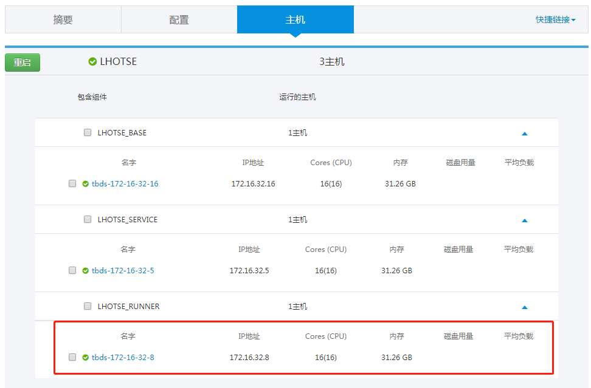
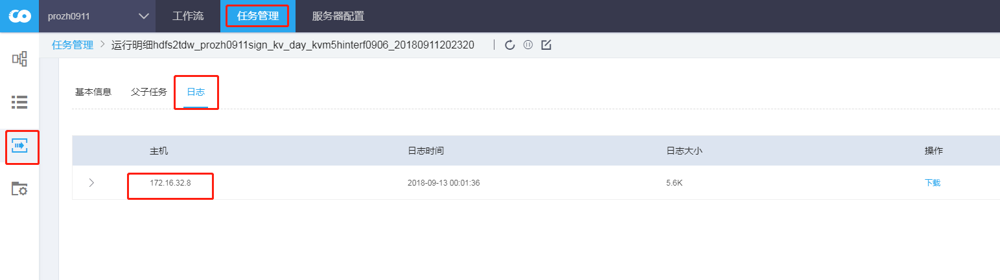

# 常用操作

## 1. 查询安装runner组件安装的节点

## 2. 查看任务信息所在数据库

## 3. 查看任务实例运行节点

## 4. 通过portal日志定位问题

portal 节点执行 tailf /usr/local/tbds-portal/log/application.log  
页面触发对应操作，获取后台异常日志

更多操作：  
清理日志  
echo "" &gt; /usr/local/tbds-portal/log/application.log  
日志重定向  
tailf /usr/local/tbds-portal/log/application.log\|tee /tmp/portal.log

## 5. 通过lhotse-service 日志定位问题

切到LHOTSE\_SERVICE 节点执行  
tailf /usr/local/lhotse\_service/logs/lhotse\_service.log  
触发相应操作，获取后台异常日志

更多操作：  
清理日志  
echo "" &gt; /usr/local/lhotse\_service/logs/lhotse\_service.log  
日志重定向  
tailf /usr/local/lhotse\_service/logs/lhotse\_service.log \|tee /tmp/tmp.log

## 6. 查看lhotse-base 日志

lhotse-base 有三个日志： 1. lhotse\_base.log  
存放系统运行日志

1. base\_schedule.log 存放实例调度过程的记录
2. base\_schedule\_statistic.log 存放实例化，依赖判断，下发正常的记录信息

## 7. 查看lhotse-runner 运行日志

存放loader 请求和执行runner 记录  
/usr/local/lhotse\_runners/log/lhotse\_task\_loader.log

## 8. 实例日志

任务实例运行日志  
存放位置  
/usr/local/lhotse\_runners/log/{taskType}/{taskId%100}/{taskId}/{cur\_run\_date}.log.{tries}

4031和 411 版本使用了dx，其日志位置  
/usr/local/lhotse\_runners/DX/logs/{taskId}/{cur\_run\_date}  
包括三个部分 log，badlog, bad 在执行异常情况下，bad 和 badlog 不为空，会列出相关的异常信息。

