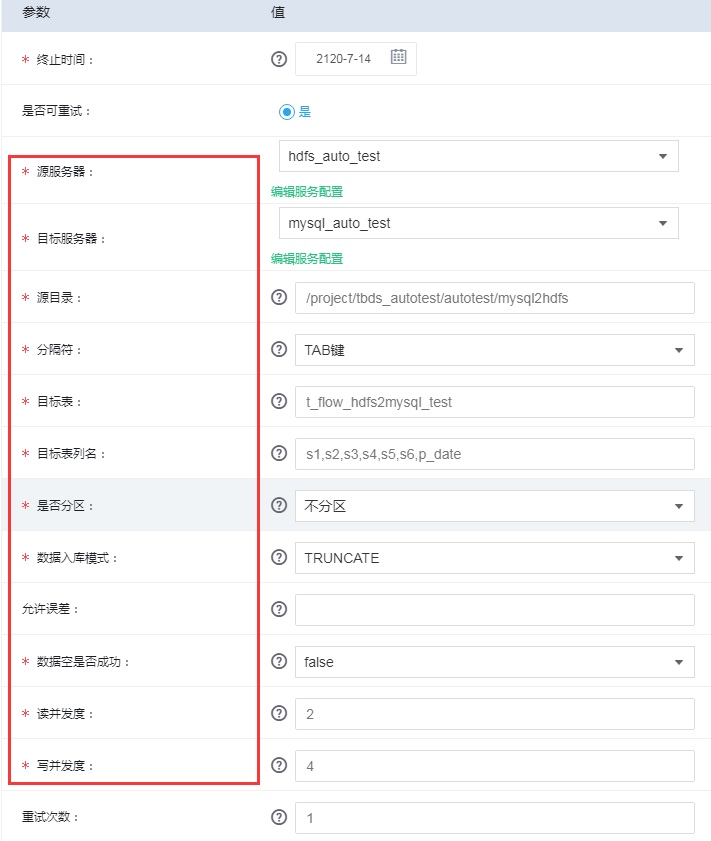

# hdfs导出DB\(mysql,postgreSQL,sql server\)

hdfs导出DB

## 功能说明

hdfs数据导出到DB ,支持mysql,postgre,sql server,oracle  
  
 hdfs导入mysql [参考](https://github.com/2019210318why-thu/manual/tree/63be01572089bb3687bf294647785c15c0dbfd2b/workflow/workflow/runners/hdfs2mysql.md)

## 其他说明

## 任务设置

### 1. 基本信息

参考 [基本信息设置](../runnerbasicinfo.md)

### 2. 调度

参考 [调度设置](../runnercycle.md)

### 3. 参数

参数配置参考下图： 

#### 3.1 源服务器

待导入数据所在的hdfs server  
更多信息参考 [服务器配置](../../services/)

#### 3.2 目标服务器

存储最终结果的 db server  
更多信息参考 [服务器配置](../../services/)

#### 3.3 源目录

存放待导入DB数据所在hdfs 存放目录  
**不支持 hdfs 数据目录不存在**

#### 3.4 分隔符

待导入DB数据在hdfs 字段分隔符  
**一个任务只能支持同一个分隔符**

#### 3.5 目标表

数据导出的目标表名，如果带有db名称，则使用db.table  
**如果插入的数据有中文，请确保创建的mysql表编码格式为utf8。**

#### 3.6 目标表列名

数据导出的目标表表列名，改列名并不一定使用跟目标表列数一致，而是需要与hdfs 数据，通过分隔符切分的数据字段个数一致。多个列名，通过 逗号 **,** 分隔  
**不支持db 表字段以整数开头**

#### 3.7 是否分区

数据导出的目标表是否是分区表。

* 如果选择否，直接写入数据。  
* 如果选择是，则需要进一步制定分区字段格式，目前只支持时间格式，通常任务调度周期和字段分区类型对应。比如任务调度周期是天，数据按天分区，分区字段选择P\_${YYYYMMDD} 。在将数据写入mysql 中，执行的sql 语句中会嵌入partition 关键字。  

#### 3.8 数据入库模式

支持两种方式，第一种是append，一种是truncate。  
如果是append模式导入，重跑任务可能会出现重复数据。truncate 模式每次导入之前都会清空数据。  
如果数据量比较大，推荐用户使用分区表，按小时，或者按天分区，并使用truncate 模式。这样大数据量的情况下，既不会出现重复删除大量数据，造成资源浪费，也不会影响用户数据的正常使用。  
  
 重跑实例的情况下，append和truncat 都会删除对应老数据，只是删除方式不一样。  
append 模式下，写入的数据会被标记，重跑实例会将前一次标记的数据删除。  
truncat 模式下，重跑实例，写入数据前会直接将对应的分区删除\(如果将是否分区设置为不分区，则会将整个表清空。）  
**请谨慎选择truncat 模式。**

#### 3.9 允许误差

整数值，表示允许失败的百分比。如果不填，表示不允许失败。 允许出错的记录数，20代表允许有20条记录可以读或者写失败，0代表不允许有任何数据读写失败。读写各算一次失败。

#### 3.10 数据为空是否成功

如果数据源数据为空，任务是否成功。  
选择是，读写数据为空，任务实例成功。  
选择否，读写数据为空，任务实例失败。

#### 3.11 读并发度

指定读取HDFS 数据时使用的读并发线程数。

#### 3.12 写并发度

指定写入DB 时使用的写并发线程数。

## demo

如上图所示

## demo资源

