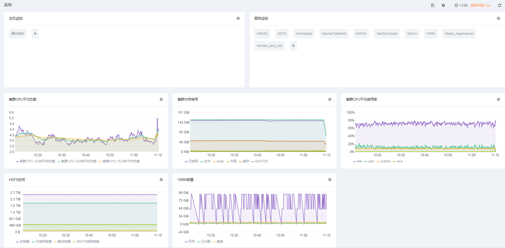
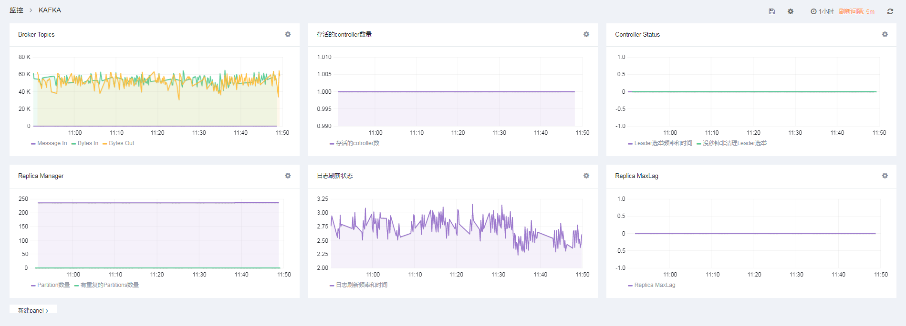
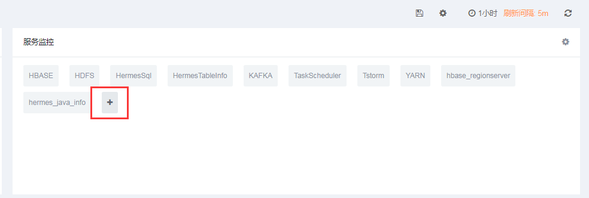
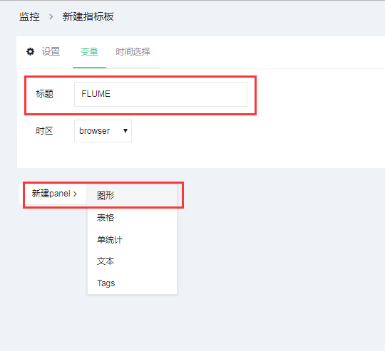
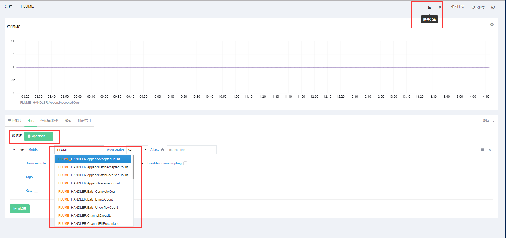

# 监控

## 1. 概述

监控指标分为两个维度：主机指标和服务指标。  
 主机指标包含：硬件指标。  
 服务指标包含：HBASE，Hbase\_regionserver，HDFS，HermesSql，HermesTableInfo，hermes\_java\_info,Kafka，TaskScheduler，Tstorm，YARN。

## 2. 主机指标

### 2.1 硬件指标

硬件指标主要收集CPU，内存，网络IO，磁盘读写等指标。用户可以通过选择主机来查看具体某台机器上的负载信息。 

## 3. 服务指标

### 3.1 KAFKA指标

KAFKA指标收集了topic信息，Controller等指标 

### 3.2 HDFS指标

HDFS指标收集了空间使用总量，文件操作，block状态，HDFS IO等指标。 

### 3.3 其他指标

此外，默认还有HBASE，Hbase\_regionserver，HermesSql，HermesTableInfo，hermes\_java\_info,TaskScheduler，Tstorm，YARN等指标。

## 3. 自定义指标模版

除了监控页面每个服务展现出来的指标模版，用户还可以自定义自己的指标模版。在指标收集中，TBDS监控平台已经收集几乎覆盖服务所有的指标，用户只需要在页面配置自定义模版即可。

添加服务指标 

填写指标名创建模版  
 

选择数据源opentsdb，输入指标名，指标名会根据输入自动提示。指标名以服务名称大写为前缀加下划线，比如FLUME，那指标统统以“FLUME\_”为前缀。最后保存即可。 

