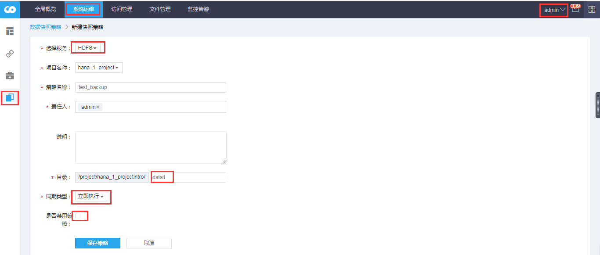
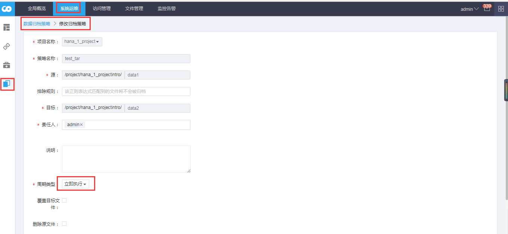
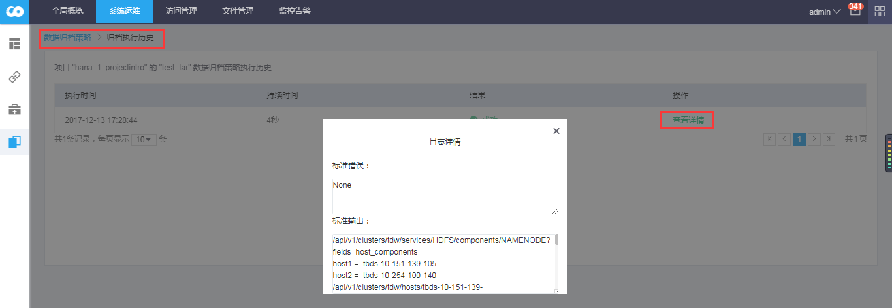

# 备份

## 概述

快照和备份是大数据套件提供的保护数据安全的功能。目前快照支持hdfs和hbase，归档支持hdfs。

HDFS快照是一个只读的基于时间点文件系统拷贝。快照可以是整个文件系统的也可以是一部分。常用来作为数据备份，防止用户错误和容灾。快照会存储在snapshottable的目录下。snapshottable下存储的snapshots 最多为65535个。没有限制snapshottable目录的数量。管理员可以设置任何的目录成为snapshottable。如果snapshottable里面存着快照，那么文件夹不能删除或者改名。

hbase快照就是一份元信息的合集，允许管理员恢复到表的先前状态。快照不是表的复制而是一个文件名称列表，因而不会复制数据。完全快照恢复是指恢复到之前的“表结构”以及当时的数据，快照之后发生的数据不会恢复。

## 使用

### 快照

 **步骤1.** 打开大数据套件TBDS的portal，输入用户名密码登录。依次进入“运维中心--&gt;系统运维--&gt;备份”。默认进入数据快照主页面

**步骤2.** 点击“新建快照策略”，进入编辑快照策略详情页面，可以填写具体策略配置信息。其中执行周期分为立即执行和按日月周等周期性执行，可以根据业务需求自行选定。

 **步骤3.** 保存好快照策略之后，可以查看和修改快照的执行情况。将鼠标放在快照策略列表的某条策略条目右侧的”“操作”上，可以查看历史执行情况，禁用该策略，重新定义策略规则等操作。

如果点击进入”“执行历史”，则可以看到快照每次历史执行的详细信息，包括执行开始时间，持续时间，以及快照生成的文件名。执行历史条目的右侧有”“操作”链接，可以查看本次执行的日志，删除快照文件，从本次快照还原文件，等操作。  

### 归档

 **步骤1.** 同快照一样，首先进入备份页面，点击右侧的“数据归档策略”，进入归档主页面，在该页面右侧点击”“新建归档策略”，进入归档策略配置编辑界面。同快照一样，归档也可以定期（周期）执行，确保数据安全。

新建好归档策略保存好后，可以对策略进行修改重新编辑以及查看归档策略的执行情况，分别如下２图所示。

