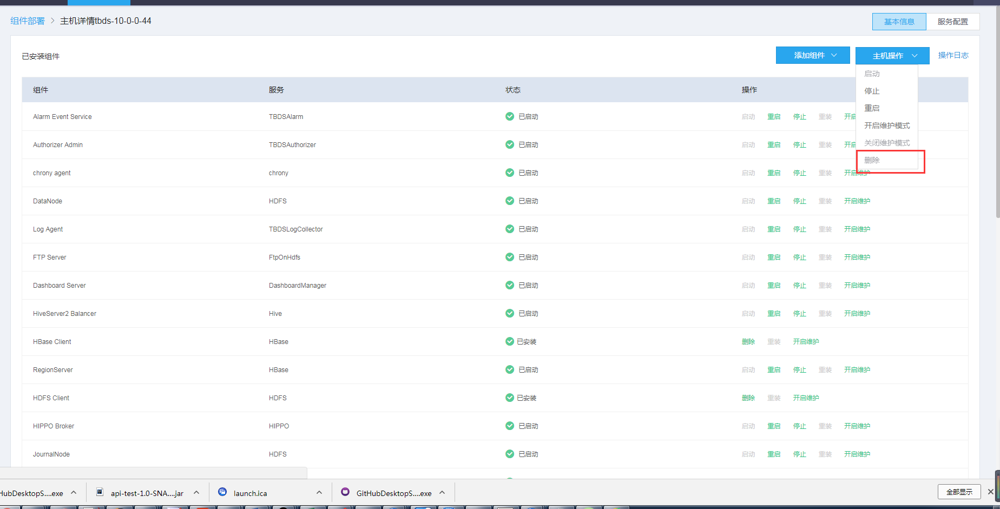
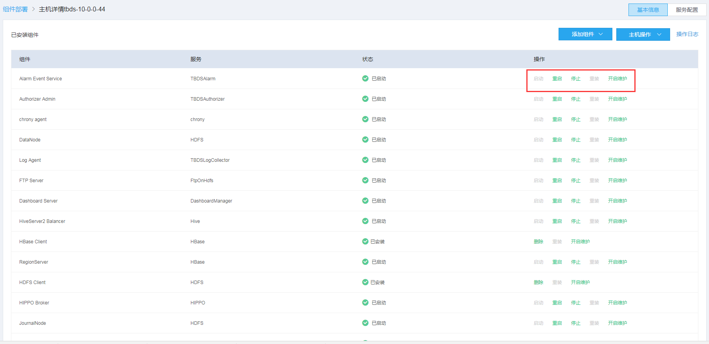
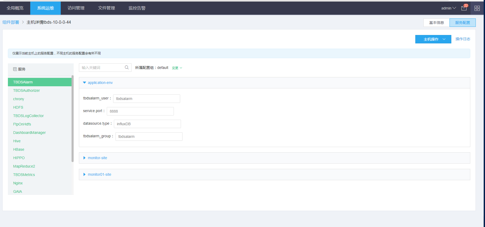
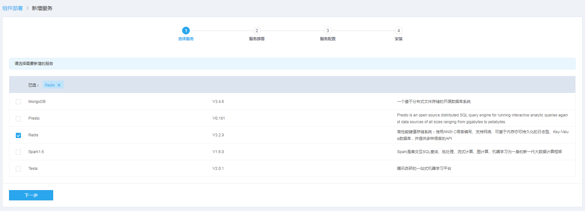
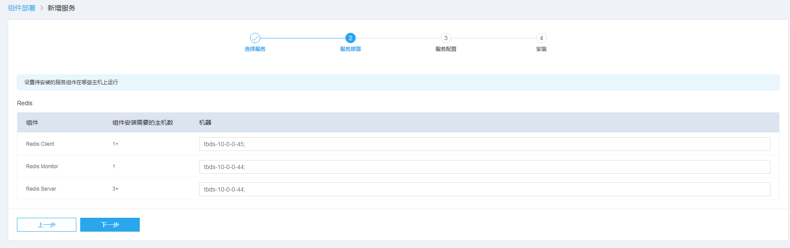
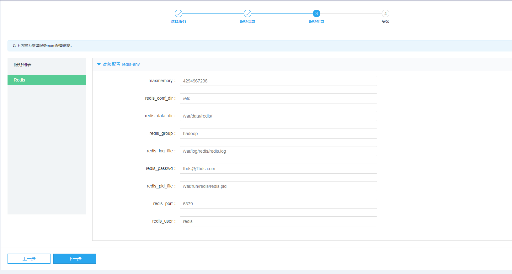
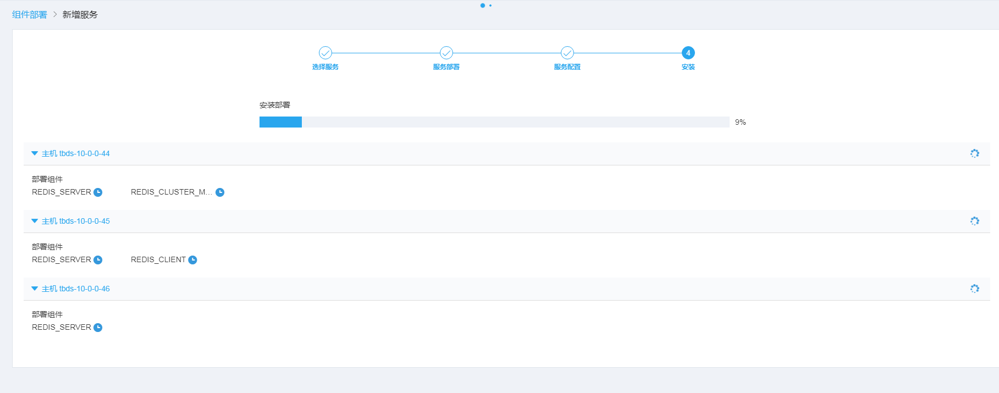
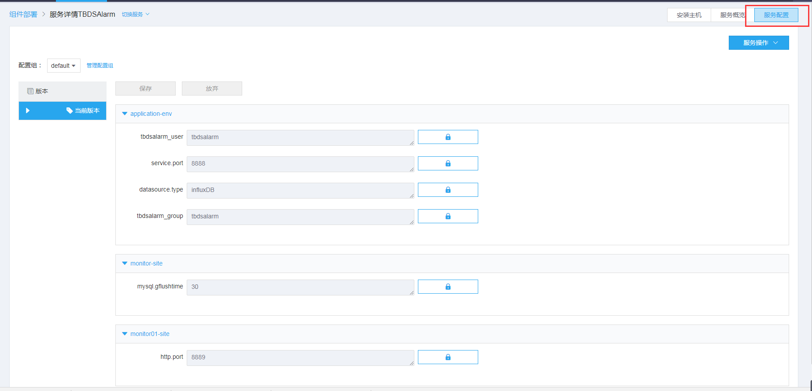

# 组件部署

## 1. 概述

组件部署分为两部分：主机管理和服务管理; 首页展示了集群整体运行情况：正常运行的或者发生错误的主机和服务，主机硬件资源\[core,内存，磁盘\]，服务的状态等信息。 

## 2. 主机管理

主机管理包括了对主机的扩容，下架，以及对该主机上所有服务的启停等操作。

### 2.1 新增主机

新增主机输入除了能在页面单个注册外，还支持批量上传。其中域名为可选项。 

### 2.2 删除主机

删除主机是一个重的操作，前提是要该主机上面的服务已经都迁移到其他机器上。 

### 2.2 管理主机服务

进入主机页面，可以查看主机上安装的所有服务组件，并提供对这些主机组件启动，重启，停止，重装，维护等操作。 

修改主机服务配置 

## 3. 服务管理

服务管理主要有新增服务，修改服务配置，服务启动停止等操作 

### 3.1 新增服务

新增服务分为四步：选择服务，服务部署，服务配置，安装  
 选择服务 

选择服务组件安装的主机 

修改服务配置 

开始安装 

### 3.2 启动停止服务

启动停止服务可在首页界面上操作，也可以进入服务页面操作  

### 3.3 修改服务配置

