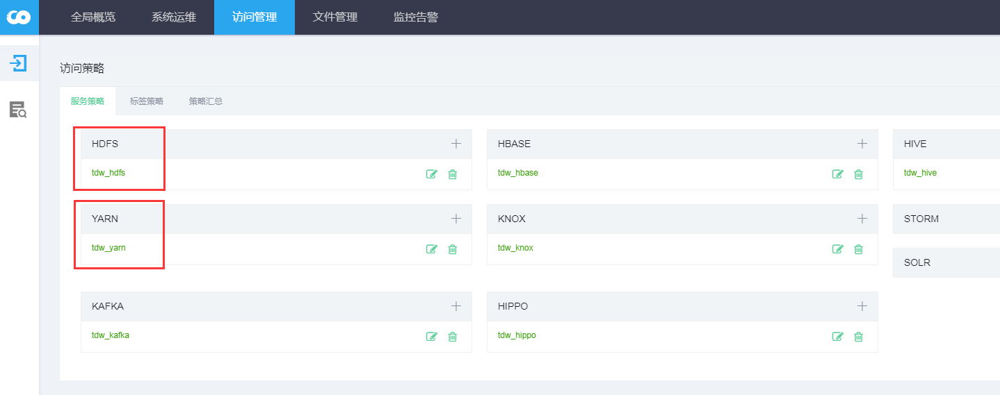
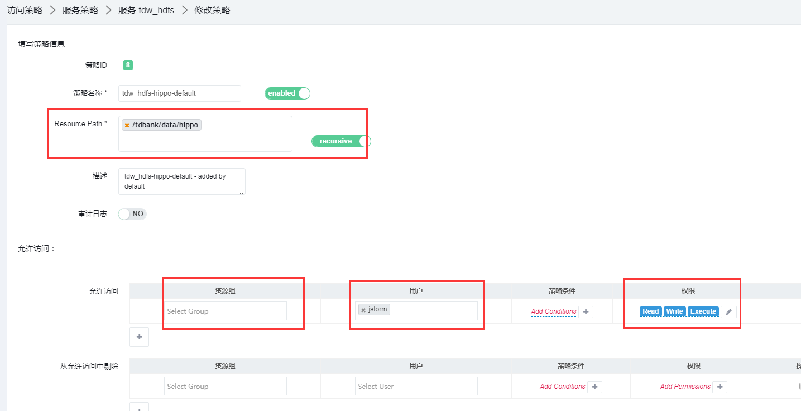
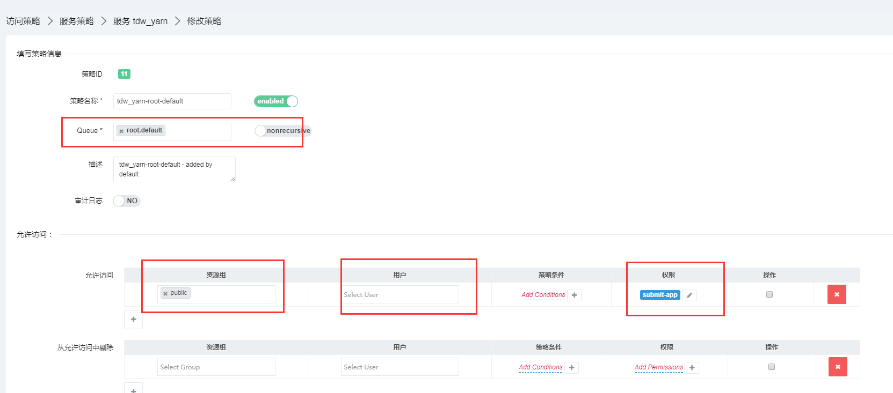

# hadoop

套件版本在安全访问层面上开发了Tbds认证，相对于社区版本提供的Simple认证和Kerberos认证，TBDS认证在保证安全的基础下，使用上更加灵活简洁。TBDS认证访问hadoop只需要提供用户认证信息：认证ID，用户名，认证密钥。

```text
    hadoop_security_authentication_tbds_secureid
    hadoop_security_authentication_tbds_username
    hadoop_security_authentication_tbds_securekey
```

 **获取认证信息** 

admin用户可以在portal创建所有用户的securekey密钥。普通用户需要securekey密钥则向管理员申请。

 **客户端访问Hadoop** 

客户端访问Hadoop只需要两步：

 _jar包替换_ ****

将客户端相关hadoop jar包替换成套件hadoop ja包，目前是2.7.2-TBDS-4.0.3.1版本。

 ****_设置环境环境变量_

设置环境变量三种方式  
Shell访问  
环境变量，给客户端程序加3个环境变量，如:

```text
　　export hadoop_security_authentication_tbds_secureid=F3QdVfxbQkNHVkn1OzLA3yK3In0bL6HgX
　　export hadoop_security_authentication_tbds_username=hdfs
　　export hadoop_security_authentication_tbds_securekey=o8AnGFYQ2lIB0AJ78TIeoJ0Uu1nkph12
```

配置文件

配置文件，放到客户端程序的hadoop配置文件中，如classpath下的core-site.xml或hdfs-site.xml：

```text
　　<property>
　　　　<name>hadoop_security_authentication_tbds_secureid</name>
　　　　<value>F3QdVfxbQkNHVkn1OzLA3yK3In0bL6HgXPmK</value>
　　</property>
　　<property>
　　　　<name>hadoop_security_authentication_tbds_username</name>
　　　　<value>hdfs</value>
　　</property>
　　<property>
　　　　<name>hadoop_security_authentication_tbds_securekey</name>
　　　　<value>o8AnGFYQ2lIB0AJ78TIeoJ0Uu1nkph12</value>
　　</property>
```

代码设置

代码设置，在hadoop client代码里加入代码片段

```text
conf.set("hadoop_security_authentication_tbds_secureid","F3QdVfxbQkNHVkn1OzLA3yK3In0bL6Hg");
　　conf.set("hadoop_security_authentication_tbds_username","hdfs");
　　conf.set("hadoop_security_authentication_tbds_securekey","o8AnGFYQ2lIB0AJ78TIeoJ0Uu1nkph12");
```

### 1.3 Webhdfs或HttpFs访问

同客户端访问hadoop原理一样，同样需要导入一些认证信息，但有web访问需要做额外的处理，我们需要手动的生成签名，客户端访问不用只是我们已经在代码里面做好这份工作。

#### 1.3.1 生成签名

生成签名，通过（secureId，currentTimeStamp，randomInt，secureKey）---&gt;signature。其中currentTimeStamp是当前时间戳，randomInt是一个随机数，Signature是我们要的输出

java示例：

```text
private String generateSignature(String secureId, long timestamp, int randomValue, String secureKey){
　　Base64 base64 = new Base64();
　　byte[] baseStr = base64.encode(HmacUtils.hmacSha1(secureKey, secureId + timestamp + randomValue));
　　
　　String result = "";
　　try {
　　　　result = URLEncoder.encode(new String(baseStr), "UTF-8");
　　} catch (UnsupportedEncodingException e) {
　　　　LOG.error("Failed to encode.", e);
　　}
　　
　　return result;
}
```

Python示例：

```text
　　def generateSignature(secureid,securekey):
　　from hashlib import sha1
　　import hmac
　　import base64
　　import urllib, urllib2
　　import time
　　import random
　　timestamp=str(long(time.time()*1000))
　　nonce=random.randint(0,2147483647)
　　seed="{0}{1}{2}".format(secureid,timestamp,nonce)
　　my_sign = hmac.new(securekey, seed, sha1).digest()
　　my_sign = base64.b64encode(my_sign)
　　signature = urllib.quote_plus(str(my_sign))
　　return "{0} {1} {2} {3}".format(secureid,timestamp,nonce,signature)
```

#### 1.3.2 web访问

header名称：tbds-auth  
header取值：secureId+" " + curTime + " " + random + " " + signature  
例子：

```text
curl -i --header "tbds-auth:PxKf1JVUDHzP0ItYSzeMIaq6HSy7STURQbPO 1506411029889 639 xfVforphUwk6MRlGN7gvPmMSRME%3D"
-X GET http://tbds-10-254-100-139:14000/webhdfs/v1/user/abc?op=LISTSTATUS&user.name=httpfs
```

## 二．权限控制

Tbds统一权限控制，hdfs和yarn所有的目录访问和资源权限都有Tbds统一权限控制。用户如果需要对某些目录和资源访问需要像管理员申请权限。  
权限管理界面在Portal 运维中心-访问管理-访问策略 页面。  
  
  
  
对于hdfs，我们会细分到每个目录对于哪些组哪些用户有哪些使用使用权限，比如读写等：  
  
  
  
  
对于yarn，我们细分到每个资源队列对于那些组哪些用户有哪些权限，不如提交app等。  




## 三．集群外客户端部署

### 3.1 客户端安装

（1）在任一安装hadoop客户端的集群内节点，打包hadoop的安装路径：/usr/hdp/2.2.0.0-2041/hadoop /，并拷贝到集群外目标客户端安装节点

（2）如果有套件的yum源，在集群外目标安装节点使用yum install安装

（3）如果有hadoop安装包，在集群外目标安装节点使用rpm -ivh安装

### 3.2 配置文件

在任一安装hadoop客户端的集群内节点，打包hadoop的配置路径： /etc/hadoop/conf，并拷贝到集群外目标客户端安装节点对应路径。

### 3.3 编译打包

套件的hadoop是基于社区二次开发，命名规则采用"社区版本号-TBDS-套件版本号"的方式命名.例：我们现在基于社区1.2.1版本的hbase进行开发，套件版本是4.0.3.3，则我们打出的hbase jar版本为1.2.1-TBDS-4.0.3.3，完整的yarn client maven jar文件名为：hadoop-yarn-client-1.2.1-TBDS-4.0.3.3.jar

#### 3.3.1基于套件提供的maven库开发

（1）拷贝或部署套件提供的maven库到开发者可访问的本地仓库或远程仓库  
（2）在客户端maven工程pom引入对应的套件版hadoop依赖，以套件4.0.3.3版本为例，需要在pom中加入的依赖片段（其他版本依次类推）：

```text
　　 <dependency>
　　     <groupId>org.apache.hbase</groupId>
　　     <artifactId> hadoop-yarn-client</artifactId>
　　     <version>1.2.1-TBDS-4.0.3.3</version>
　　 </dependency>
```

### 3.4 运行

运行客户端代码与社区方式无区别

### 3.5 Hadoop HDFS简单实例

1\) jar包

jar包作用：查看HDFS目录下文件详情

2\) 样例代码

```java
package com.tencent.hdfs;

import org.apache.hadoop.conf.Configuration;
import org.apache.hadoop.fs.*;
import org.apache.hadoop.security.UserGroupInformation;
import java.io.IOException;
import java.net.URISyntaxException;
import com.tencent.conf.ConfigurationManager;


public class HDFSFileDemo {
    public static void main(String[] args) throws IOException, URISyntaxException, InterruptedException {
        FileSystem fs = null;
        try {
            Configuration conf = new Configuration();
            conf.addResource(new Path("/etc/hadoop/conf/core-site.xml"));
            conf.addResource(new Path("/etc/hadoop/conf/hdfs-site.xml"));

            if (args != null && args.length == 4) {
                conf.set("hadoop.security.authentication", "tbds");
                conf.set("hadoop_security_authentication_tbds_secureid", args[0]);
                conf.set("hadoop_security_authentication_tbds_username", args[1]);
                conf.set("hadoop_security_authentication_tbds_securekey", args[2]);
            } else {
                //加入tbds的认证参数
                conf.set("hadoop.security.authentication", ConfigurationManager.getProperty("hadoop.security.authentication"));
                conf.set("hadoop_security_authentication_tbds_username", ConfigurationManager.getProperty("hadoop_security_authentication_tbds_username"));
                conf.set("hadoop_security_authentication_tbds_secureid", ConfigurationManager.getProperty("hadoop_security_authentication_tbds_secureid"));
                conf.set("hadoop_security_authentication_tbds_securekey", ConfigurationManager.getProperty("hadoop_security_authentication_tbds_securekey"));
            }
            UserGroupInformation.setConfiguration(conf);
            UserGroupInformation.loginUserFromSubject(null);

            //拿到一个文件系统操作的客户端实例对象
            fs = FileSystem.get(conf);


            Path basePath = new Path(args[3]);

//          FileStatus[] listStatus = fs.listStatus(basePath);
//    		for (FileStatus fileStatus : listStatus) {
//    			System.out.println(fileStatus.getPath()+"------》》》"+fileStatus.toString());
//    		}
//
            //找到对应目录下的所有的文件
            RemoteIterator<LocatedFileStatus> listFiles = fs.listFiles(basePath, false);  //false 不递归查找
            while (listFiles.hasNext()) {
                LocatedFileStatus next = listFiles.next();
                String name = next.getPath().getName();
                Path path = next.getPath();
                System.out.println(name + "------>>>" + path.toString());
            }

        } catch (Exception e) {
            e.printStackTrace();
        }
    }
}
```

3\) pom.xml文件

```markup
<?xml version="1.0" encoding="UTF-8"?>
<project xmlns="http://maven.apache.org/POM/4.0.0"
         xmlns:xsi="http://www.w3.org/2001/XMLSchema-instance"
         xsi:schemaLocation="http://maven.apache.org/POM/4.0.0 http://maven.apache.org/xsd/maven-4.0.0.xsd">
    <parent>
        <artifactId>TBDSDemo</artifactId>
        <groupId>com.tencent</groupId>
        <version>1.0-SNAPSHOT</version>
    </parent>
    <modelVersion>4.0.0</modelVersion>

    <artifactId>HadoopHDFS</artifactId>
    <!--  tencent maven远程库   -->
    <repositories>
        <repository>
            <id>tbds</id>
            <url>https://tbdsrepo.cloud.tencent.com/repository/tbds/</url>
            <snapshots>
                <enabled>true</enabled>
                <updatePolicy>always</updatePolicy>
            </snapshots>
            <releases>
                <enabled>true</enabled>
                <updatePolicy>always</updatePolicy>
            </releases>
        </repository>
    </repositories>

    <properties>
        <project.build.sourceEncoding>UTF-8</project.build.sourceEncoding>
        <junit.version>4.12</junit.version>
        <hadoop.version>2.7.2-TBDS-5.1.3.0</hadoop.version>
        <log4j.version>2.12.0</log4j.version>
    </properties>

    <dependencies>
        <dependency>
            <groupId>junit</groupId>
            <artifactId>junit</artifactId>
            <version>${junit.version}</version>
        </dependency>
        <dependency>
            <groupId>org.apache.logging.log4j</groupId>
            <artifactId>log4j-slf4j-impl</artifactId>
            <version>${log4j.version}</version>
        </dependency>

        <dependency>
            <groupId>org.apache.hadoop</groupId>
            <artifactId>hadoop-client</artifactId>
            <version>${hadoop.version}</version>
        </dependency>
    </dependencies>

    <build>
        <plugins>
            <plugin>
                <artifactId>maven-compiler-plugin</artifactId>
                <version>2.3.2</version>
                <configuration>
                    <source>1.8</source>
                    <target>1.8</target>
                </configuration>
            </plugin>
            <plugin>
                <artifactId>maven-assembly-plugin </artifactId>
                <configuration>
                    <descriptorRefs>
                        <descriptorRef>jar-with-dependencies</descriptorRef>
                    </descriptorRefs>
                    <archive>
                        <manifest>
                            <mainClass>com.tencent.hdfs.HadoopHDFSFileDemo</mainClass>
                        </manifest>
                    </archive>
                </configuration>
                <executions>
                    <execution>
                        <id>make-assembly</id>
                        <phase>package</phase>
                        <goals>
                            <goal>single</goal>
                        </goals>
                    </execution>
                </executions>
            </plugin>
        </plugins>
    </build>

</project>
```

4\) Demo提交运行步骤

```markup
# 1.设置环境变量
[root@tbds-10-1-0-126 ~]# vim /etc/profile
# 添加
export JAVA_HOME=/usr/jdk64/jdk1.8.0_191
export HADOOP_HOME=/usr/hdp/2.2.0.0-2041/hadoop
export PATH=$PATH:$JAVA_HOME/bin:$HADOOP_HOME/bin

# 2.运行代码
# HadoopHDFSDemo.jar：执行jar包路径
# 参数1：hadoop_security_authentication_tbds_secureid
# 参数2：hadoop_security_authentication_tbds_username
# 参数3：hadoop_security_authentication_tbds_securekey
# 参数4：文件所在目录
hadoop jar HadoopHDFSDemo.jar 46euF5bK2KeWplkVzyXPZfeJGw2SGI7RD*** admin RDyQwfnl0gApSeH1fyDUF2kXP0Ya4*** hdfs://hdfsCluster/test/input
```

5\) 预期结果

```markup
wc.txt------>>>hdfs://hdfsCluster/test/input/wc.txt
```

### 3.6 Hadoop MR简单示例

1\) jar包

jar包作用：wordcount

2\) 样例代码

WordcountDriver

```java
package com.tencent.hadoop.mr;

import org.apache.hadoop.conf.Configuration;
import org.apache.hadoop.fs.Path;
import org.apache.hadoop.io.IntWritable;
import org.apache.hadoop.io.Text;
import org.apache.hadoop.mapreduce.Job;
import org.apache.hadoop.mapreduce.lib.input.FileInputFormat;
import org.apache.hadoop.mapreduce.lib.output.FileOutputFormat;

import com.tencent.conf.ConfigurationManager;

/**
 * 相当于一个yarn集群的客户端
 * 需要在此封装我们的mr程序的相关运行参数，指定jar包
 * 最后提交给yarn
 * @author
 */
public class WordcountDriver {

    public static void main(String[] args) throws Exception {

        if(args == null || args.length != 5){
           System.err.println("Usage: <inputpath> <outputpath> <secureid> <username> <securekey> ");
           System.exit(1);
       }

        Configuration conf = new Configuration();


        if(args != null && args.length == 5) {
            conf.set("hadoop.security.authentication","tbds");
            conf.set("hadoop_security_authentication_tbds_secureid",args[2]);
            conf.set("hadoop_security_authentication_tbds_username",args[3]);
            conf.set("hadoop_security_authentication_tbds_securekey",args[4]);
        }else{
            //加入tbds的认证参数
            conf.set("hadoop.security.authentication", ConfigurationManager.getProperty("hadoop.security.authentication"));
            conf.set("hadoop_security_authentication_tbds_username",ConfigurationManager.getProperty("hadoop_security_authentication_tbds_username"));
            conf.set("hadoop_security_authentication_tbds_secureid",ConfigurationManager.getProperty("hadoop_security_authentication_tbds_secureid"));
            conf.set("hadoop_security_authentication_tbds_securekey",ConfigurationManager.getProperty("hadoop_security_authentication_tbds_securekey"));
        }

        Job job = Job.getInstance(conf);

        //指定本程序的jar包所在的本地路径
        job.setJarByClass(WordcountDriver.class);

        //指定本业务job要使用的mapper/Reducer业务类
        job.setMapperClass(WordcountMapper.class);
        job.setReducerClass(WordcountReducer.class);

        //指定mapper输出数据的kv类型
        job.setMapOutputKeyClass(Text.class);
        job.setMapOutputValueClass(IntWritable.class);

        //指定最终输出的数据的kv类型
        job.setOutputKeyClass(Text.class);
        job.setOutputValueClass(IntWritable.class);

        //指定job的输入原始文件所在目录
        FileInputFormat.setInputPaths(job, new Path(args[0]));
        //指定job的输出结果所在目录
        FileOutputFormat.setOutputPath(job, new Path(args[1]));

        //将job中配置的相关参数，以及job所用的java类所在的jar包，提交给yarn去运行
        /*job.submit();*/
        boolean res = job.waitForCompletion(true);
        System.exit(res?0:1);
    }
}
```

WordcountMapper

```java
package com.tencent.hadoop.mr;

import java.io.IOException;
import org.apache.hadoop.io.IntWritable;
import org.apache.hadoop.io.LongWritable;
import org.apache.hadoop.io.Text;
import org.apache.hadoop.mapreduce.Mapper;


/**
 * KEYIN: 默认情况下，是mr框架所读到的一行文本的起始偏移量，Long,
 * 但是在hadoop中有自己的更精简的序列化接口，所以不直接用Long，而用LongWritable
 * VALUEIN:默认情况下，是mr框架所读到的一行文本的内容，String，同上，用Text
 * KEYOUT：是用户自定义逻辑处理完成之后输出数据中的key，在此处是单词，String，同上，用Text
 * VALUEOUT：是用户自定义逻辑处理完成之后输出数据中的value，在此处是单词次数，Integer，同上，用IntWritable
 * @author
 */

public class WordcountMapper extends Mapper<LongWritable, Text, Text, IntWritable> {

    /**
     * map阶段的业务逻辑就写在自定义的map()方法中
     * maptask会对每一行输入数据调用一次我们自定义的map()方法
     */
    @Override
    protected void map(LongWritable key, Text value, Context context) throws IOException, InterruptedException {

        //将maptask传给我们的文本内容先转换成String
        String line = value.toString();
        //根据空格将这一行切分成单词
        String[] words = line.split(" ");
        //将单词输出为<单词，1>
        for (String word : words) {
            //将单词作为key，将次数1作为value，以便于后续的数据分发，可以根据单词分发，以便于相同单词会到相同的reduce task
            context.write(new Text(word), new IntWritable(1));
        }
    }
}
```

WordcountReducer

```java
package com.tencent.hadoop.mr;


import java.io.IOException;
import java.util.Iterator;

import org.apache.hadoop.io.IntWritable;
import org.apache.hadoop.io.Text;
import org.apache.hadoop.mapreduce.Reducer;

/**
 * KEYIN, VALUEIN 对应  mapper输出的KEYOUT,VALUEOUT类型对应
 * KEYOUT, VALUEOUT 是自定义reduce逻辑处理结果的输出数据类型
 * KEYOUT是单词
 * VLAUEOUT是总次数
 * @author
 */
public class WordcountReducer extends Reducer<Text, IntWritable, Text, IntWritable>{

    /**
     * <hello,1><hello,1><hello,1><hello,1><hello,1><hello,1>
     * <banana,1><banana,1><banana,1><banana,1><banana,1><banana,1>
     * 入参key，是一组相同单词kv对的key
     */
    @Override
    protected void reduce(Text key, Iterable<IntWritable> values, Context context) throws IOException, InterruptedException {

        int count=0;
        Iterator<IntWritable> iterator = values.iterator();
        while(iterator.hasNext()){
            count += iterator.next().get();
        }
        context.write(key, new IntWritable(count));

    }

}
```

3\) pom.xml文件

```markup

```

4\) Demo提交运行步骤

```markup
# 2.1 环境变量配置
export HADOOP_HOME=/usr/hdp/2.2.0.0-2041/hadoop
export JAVA_HOME=/usr/jdk64/jdk1.8.0_191
export PATH=$PATH:$JAVA_HOME/bin:$HADOOP_HOME/bin

2.2 上传jar包并执行
# 参数1：指定job的输入原始文件所在目录
# 参数2：指定job的输出原始文件所在目录 注：必须为不存在目录
# 参数3：hadoop_security_authentication_tbds_secureid
# 参数4：hadoop_security_authentication_tbds_username
# 参数5：hadoop_security_authentication_tbds_securekey
# 例：
[root@tbds-10-1-0-126 jar]#  hadoop jar HadoopMRTbds.jar /test/input /output 46euF5bK2KeWplkVzyXPZfeJGw2SGI7RD*** adm** RDyQwfnl0gApSeH1fyDUF2kXP0Ya4***
```

