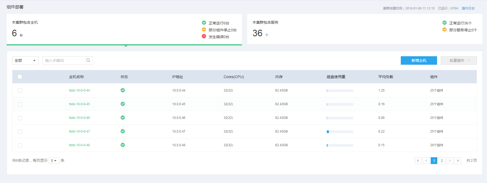
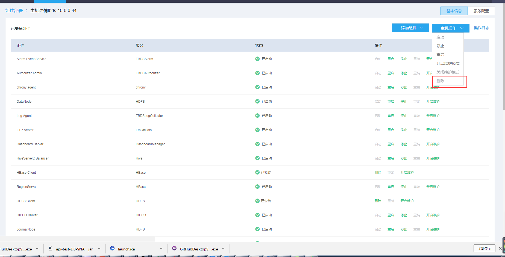
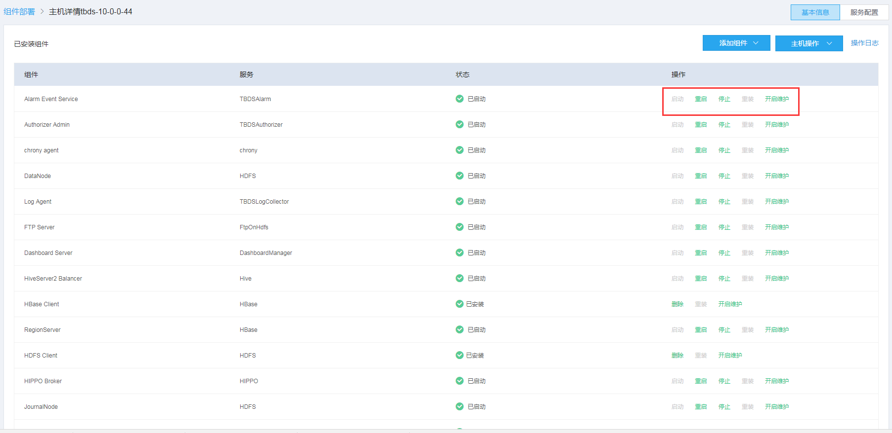
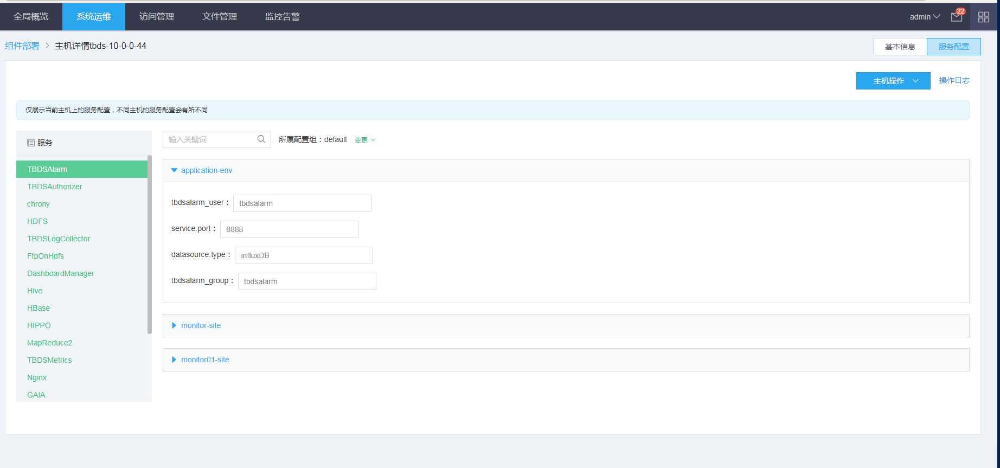
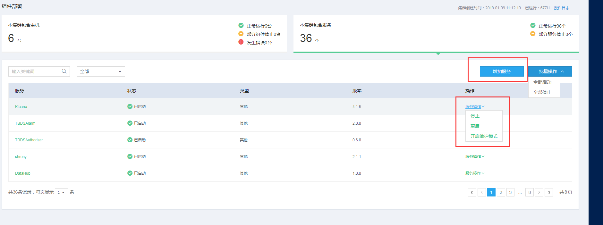
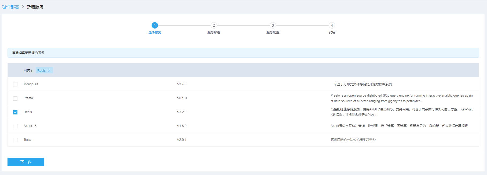
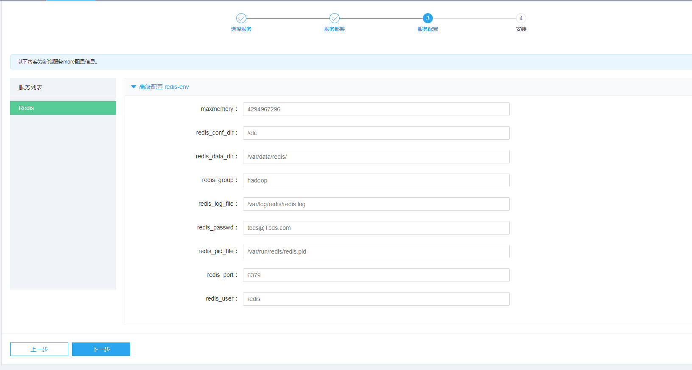
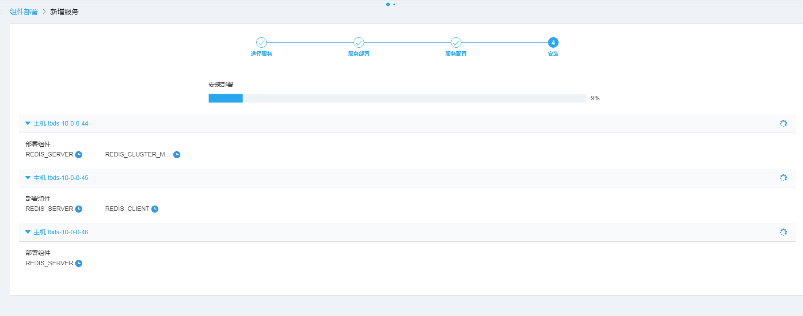
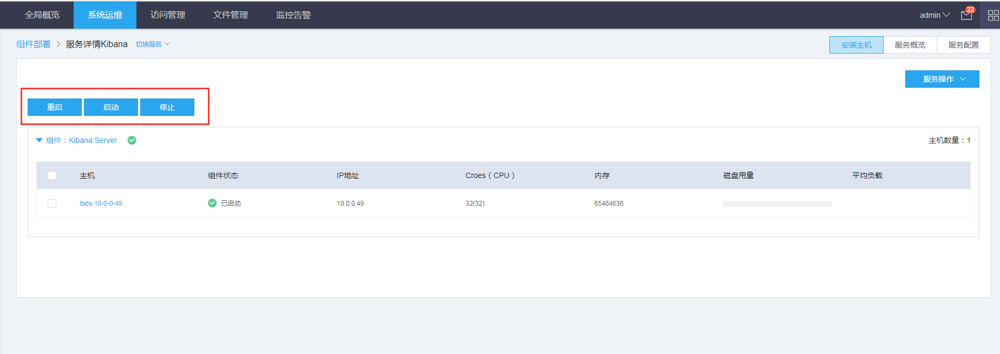
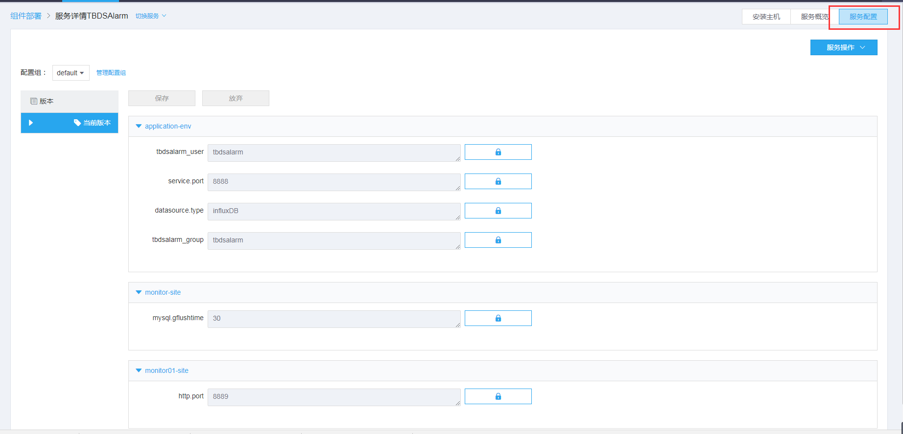

## 1. 概述
组件部署分为两部分：主机管理和服务管理; 首页展示了集群整体运行情况：正常运行的或者发生错误的主机和服务，主机硬件资源[core,内存，磁盘]，服务的状态等信息。

## 2. 主机管理
主机管理包括了对主机的扩容，下架，以及对该主机上所有服务的启停等操作。

### 2.1 新增主机
新增主机输入除了能在页面单个注册外，还支持批量上传。其中域名为可选项。

### 2.2 删除主机
删除主机是一个重的操作，前提是要该主机上面的服务已经都迁移到其他机器上。

### 2.2 管理主机服务
进入主机页面，可以查看主机上安装的所有服务组件，并提供对这些主机组件启动，重启，停止，重装，维护等操作。

修改主机服务配置

## 3. 服务管理
服务管理主要有新增服务，修改服务配置，服务启动停止等操作

### 3.1 新增服务
新增服务分为四步：选择服务，服务部署，服务配置，安装 
选择服务

选择服务组件安装的主机

修改服务配置

开始安装

### 3.2 启动停止服务
启动停止服务可在首页界面上操作，也可以进入服务页面操作

### 3.3 修改服务配置

